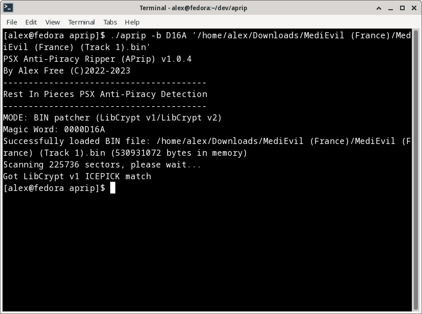
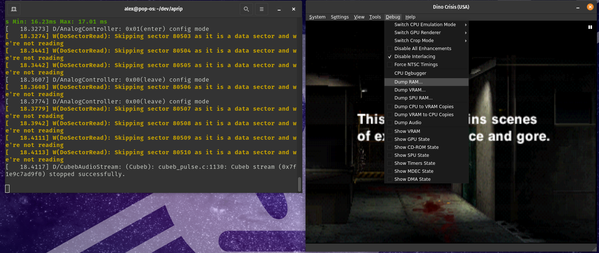
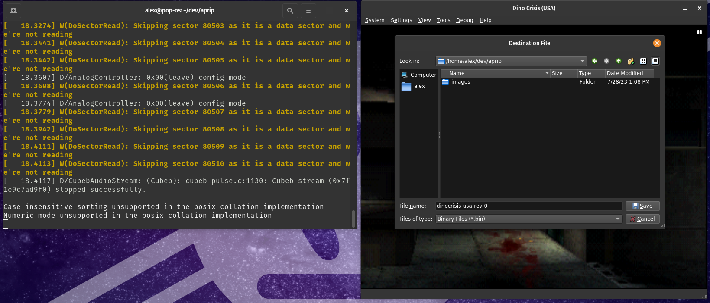

# [alex-free.github.io](https://alex-free.github.io)

# APrip: Advanced Generic PSX Anti-Piracy Protection Patcher

By Alex Free

APrip patches various additional anti-piracy copy protection implementations found in some PSX games released later in the console's lifecycle. APrip patches enable playing such games on unmodified consoles (no mod-chip installed) with a [soft-mod](#soft-mods).

## Table Of Contents

*   [Downloads](#downloads)
*   [Anti-Piracy Implementations](#anti-piracy-implementations)
*   [Patching The CD Image](#patching-the-cd-image)
*   [Generating GameShark Codes](#generating-gameshark-codes)
*   [Converting An Existing GameShark Codes](#converting-an-existing-gameshark-code).

_More Info_

*   [Soft-Mods](#soft-mod)
*   [How It Works](#how-it-works)
*   [License](#license)
*   [Credits](#credits)

## Links

*	[Homepage](https://alex-free.github.io/aprip)
*	[Github](https://github.com/alex-free/aprip)
*	[Tonyhax International](https://alex-free.github.io/tonyhax-international)
*	[Tonyhax International APv2 Bypass System](https://alex-free.github.io/tonyhax-international/anti-piracy-bypass.html)
*   [FF VIII APv1 Reversing](https://consolecopyworld.com/psx/psx_ff8_protection.shtml)
*   [MediEvil LibCrypt v1 Reversing](https://consolecopyworld.com/psx/psx_medievil.shtml)
*   [LibCrypt PS1 Protection Bible](https://red-j.github.io/Libcrypt-PS1-Protection-bible/index.htm)
*   [APv2 Decomp/Reversing By Socram8888](https://github.com/socram8888/tonyhax/blob/master/docs/ap_v2.c)

## Downloads

### Version 1.0.5 (7/28/2023)

*	[aprip-1.0.5-windows\_x86](https://github.com/alex-free/aprip/releases/download/v1.0.5/aprip-1.0.5-windows_x86.zip) _For Windows 95 OSR 2.5 Or Newer (32-bit Windows)_
*	[aprip-1.0.5-windows\_x86\_64](https://github.com/alex-free/aprip/releases/download/v1.0.5/aprip-1.0.5-windows_x86_64.zip) _For 64-bit Windows_
*	[aprip-1.0.5-linux\_x86](https://github.com/alex-free/aprip/releases/download/v1.0.5/aprip-1.0.5-linux_x86_static.zip) _For x86 Linux Distros_
*	[aprip-1.0.5-linux\_x86\_64](https://github.com/alex-free/aprip/releases/download/v1.0.5/aprip-1.0.5-linux_x86_64_static.zip) _For x86_64 Linux Distros_
*	[aprip-1.0.5-source](https://github.com/alex-free/aprip/archive/refs/tags/v1.0.5.zip)

Changes:

*	Removed broken non-stealth mod-chip APv1/APv2 patching.

*   Improved and cleaned up code, enabling build on Pop!OS.

*   Added info on [EDC](#edc) Protected games.

[About Previous Versions](changelog.md).

## Anti-Piracy Implementations

Starting in late 1998, some specific PSX games began implementing additional copy protection designed to prevent playing backup CD-R copies or import discs of said game. Different types of additional copy protection have been found in PSX games over the years.

### APv1

The very first kind of additional anti-piracy copy protection that appeared was in the Japanese game [PoPoRogue](http://redump.org/disc/1552/). It is only found in various Japanese PSX games, no other region saw any game release with it. This protection only triggers on consoles with a non-stealth mod-chip installed. A non-stealth mod-chip was the first design of PSX mod-chips released. Later 'stealth' mod-chip designs don't trip APv1 protection. Unmodified consoles using a [soft-mod](#soft-mod) or a [traditional swap trick](https://gamefaqs.gamespot.com/ps/916392-playstation/faqs/4708) also don't trip it. **APrip does not support patching APv1 games.**

### APv2

This protection was first seen in the japanese release of [Dino Crisis](http://redump.org/disc/1598/). It is found in various PSX games spanning every region, not just in Japan like the original APv1 protection was limited to. This protection is a lot more advanced then it's predecessor, APv1. APv2 triggers on consoles with a non-stealth mod-chip installed like APv1. A non-stealth mod-chip was the first design of PSX mod-chips released. Later 'stealth' mod-chip designs don't trip APv2 protection, just like how they don't trip APv1 protection. But this time it also triggers when using a [traditional swap trick](https://gamefaqs.gamespot.com/ps/916392-playstation/faqs/4708) on unmodified consoles. On all consoles except the SCPH-1000 and early SCPH-3000 models, it also even triggers when booting games containing it with [a soft-mod](#soft-mod).

[CD image patching](#patching-the-cd-image) has a less then 100% success rate for APv2 because some games compress and or obsfucate the vulnerable APv2 code to make it invisible from the CD image.

[GameShark code generation](#generating-gameshark-codes) for APv2 appears to have a 100% success rate with all APv2 games ever released. This is because even if the game compresses and or obfuscates the vulnerable APv2 code, at runtime in RAM it is plain as day and shared between all titles with APv2 protection

APrip generated GameShark codes power the [anti-piracy bypass system](https://alex-free.github.io/tonyhax/anti-piracy-bypass.html) in [Tonyhax International](https://alex-free.github.io/tonyhax), enabling the play of many [games](https://alex-free.github.io/tonyhax-international/anti-piracy-bypass.html#apv2-bypasses).

### LibCrypt v1

This protection is only found in the PAL region releases of [MediEvil](http://redump.org/disc/592/). It does not check for swap tricks, soft-mods, or even non-stealth mod-chips. It only checks for evidence that the running game is a burned backup copy. APrip supports [CD image patching](#patching-the-cd-image) every game disc ever released it:

*   [MediEvil Europe](http://redump.org/disc/592/)
*   [MediEvil France](http://redump.org/disc/13389/)
*   [MediEvil Germany](http://redump.org/disc/25542/)
*   [MediEvil Italy](http://redump.org/disc/29475/)
*   [MediEvil Spain](http://redump.org/disc/1584/)

### LibCrypt v2

This is a serious upgrade to LibCrypt v1. Not only does it check for evidence that the running game is a burned backup copy, it checks for [traditional swap trick](https://gamefaqs.gamespot.com/ps/916392-playstation/faqs/4708), [soft-mods](#soft-mod), non-stealth mod-chips, and the presence of a Pro Action Replay cheat device installed to the console. This version of LibCrypt is the most common version of the protection. 

[CD image patching](#patching-the-cd-image) most likely has a less then 100% success rate, but this is neither confirmed or denied yet. If you LibCrypt v2 game can indeed be aprip patched, then even non-stealth mod-chips won't trip the protection (unlike the APv2 patching).

### LibCrypt v3

This upgrade to LibCrypt v2 has all the same protection triggers but the actual code implementation is encrypted. **Aprip does not support patching LibCrypt v3**

### LibCrypt v4

A strange final hurrah for LibCrypt, this version of the protection was only used in the PAL region releases of the game F1 2000. Unlike LibCrypt v3 and LibCrypt v2 it only checks for evidence that the running game is a burned backup copy (much like LibCrypt v1, but with more complex encrypted implementation). It does not check for swap tricks, soft-mods, or even non-stealth mod-chips. **Aprip does not support patching LibCrypt v4**

LibCrypt v4 discs:

*   [F1 2000 PAL Release 1](http://redump.org/disc/4311/).
*   [F1 2000 PAL Release 2](hhttp://redump.org/disc/48119/).

### EDC

Introduced in the japanese release of the very first [Dance Dance Revolution](http://redump.org/disc/1562/) game for the psx console, EDC protection only checks for evidence that the running game is a burned backup copy (much like LibCrypt v1 and LibCrypt v4).

Use the [EDCRE](https://alex-free.github.io/edcre/#usage) patcher on the CD disc image first and then burn the final CD image to disc in [raw](https://alex-free.github.io/edcre/#burning-edc-protected-psx-games-correctly) to get the EDC protected games working correctly:

*   Dance Dance Revolution ([Japan](http://redump.org/disc/1562/), [USA](http://redump.org/disc/16075/)). _Japan release also has [APv1](#apv1)_

*   Dance Dance Revolution: Best Hits ([Japan](http://redump.org/disc/30601/)). _Also has [APv2](#apv2)_

*   Dance Dance Revolution Konamix ([USA](http://redump.org/disc/1238/)).

*   Dance Dance Revolution Extra Mix ([Japan](http://redump.org/disc/44438/)). _Also has [APv2](#apv2)_

*   Dance Dance Revolution 2nd Remix ([Japan](http://redump.org/disc/9477/)). _Also has [APv2](#apv2)_

*   Dance Dance Revolution 3rd Mix ([Japan](http://redump.org/disc/9536/)). _Also has [APv2](#apv2)_

*   Dance Dance Revolution 4th Mix ([Japan](http://redump.org/disc/34157/)). _Also has [APv2](#apv2)_

*   Dance Dance Revolution 5th Mix ([Japan](http://redump.org/disc/34157/)). _Also has [APv2](#apv2)_

## Soft-Mods

These PSX soft-mods are capable of correctly playing APrip [patched BIN+CUE CD images](#patching-the-cd-image):

* [Stealth Unlocker](https://www.psxdev.net/forum/viewtopic.php?t=3966)

* [Tonyhax International](https://alex-free.github.io/tonyhax-international)

* [Tonyhax](https://orca.pet/tonyhax/)

* [UniROM](https://unirom.github.io/)

Out of the above, all except UniROM have anti-piracy bypass systems implemented for at least some games (and dare I say Tonyhax International's supported bypasses are [quite extensive](https://alex-free.github.io/tonyhax-international/anti-piracy-bypass.html#apv2-bypasses)). 

For any games which don't have a bypass implemented, APrip is here to save the day. [Tonyhax International](https://alex-free.github.io/tonyhax-international) even has a [GameShark feature](https://alex-free.github.io/tonyhax-international/gameshark-code-support.html) that allows you to use [APrip generated GameShark codes](#generating-gameshark-codes). 

## Patching The CD Image

APrip can take some time to patch a BIN file as it has to scan the entire file. Depending on how fast the computer you run APrip on is (and how big the BIN file is), this may take a literal minute or 2 to complete. Maybe more for slower systems.

The first thing to do is to rip and or acquire a CD image of your desired game. Then depending on what protection the game requires, follow the instructions below for either APv2 or LibCrypt v1/LibCrypt v2.

### For APv2

*	On Linux, execute `./aprip -b <track 01.bin>` in your Terminal. On Windows, execute  `aprip.exe -b <track 01.bin>` in `cmd.exe`. _Replace `<track 01.bin>` with the actual data track from the game you want to patch_.

*	If you see `got APv2 table match` then congratulations, the game now works with unmodified consoles using [soft-mod](#soft-mod).

### For LibCrypt v1/LibCrypt v2

*	On Linux, execute `./aprip -b <magic word> <track 01.bin>` in your Terminal. On Windows, execute  `aprip.exe -b <magic word> <track 01.bin>` in `cmd.exe`. _Replace `<track 01.bin>` with the actual data track from the game you want to patch_. Replace `<magic word>` with the correct magic word (MW:), which you can find from the [PS1 Custom Patches](https://www.psdevwiki.com/ps3/PS1_Custom_Patches) page on the PS3 Dev Wiki among other places.

*	If you see:

`Got LibCrypt 2 Anti-Pro Action Replay match`

`Got LibCrypt 2 Anti-Mod-Chip match`

`Got LibCrypt 2 Magic Word match`

Or:

`Got LibCrypt v1 ICEPICK match`

then congratulations, the game will work with unmodified consoles using a [soft-mod](#soft-mods) or even a non-stealth mod-chipped console.

## Generating GameShark Codes

Instead of patching the BIN file of the CD image directly (or if you have a real import PSX disc), you can generate GameShark codes to do the same thing as a CD image patching. GameShark code generation has a seemingly 100% success rate, and works when [CD image patching](#patching-the-cd-image) doesn't.

You'll need the download the [DuckStation](https://github.com/stenzek/duckstation/releases) emulator. Start the emulator and navigate to the `Advanced` Settings pane. Change your settings pane so it looks like this image below:

Also, ensure that the _Enable 8MB RAM_ option is **left untouched** as shown in the image below:

Now you can generate some GameShark codes with APrip:

*	Rip or acquire a CD image of your desired game.

*	On Linux, execute `./ap-type-checker.sh <duckstation executable> <game cue file>` in your Terminal. On Windows, execute `ap-type-checker.bat <duckstation executable> <game cue file>`. Replace `<duckstation executable>` with the actual file path of the DuckStation executable. Replace `<game cue file>` with the target game's cue file that contains additional anti-piracy copy protection.

*	**Monitor the terminal, when you see the yellow text `as it is a data sector and we're not reading` immediately pause emulation and dump the memory to a file** as the anti-piracy code has begun running at that time.

*	On Linux, execute `./aprip -gs <path to mem dump file>` in your Terminal. On Windows, execute `aprip.exe -gs <path to mem dump file>` in `cmd.exe`. Replace `<path to mem dump file` with the actual file path to the memory dump from DuckStation. If you timed your memory dump correctly you will see GameShark codes generated by the output of APrip.

## Converting An Existing GameShark Code

If you have an existing code in this format:

`D0XXXXXX YYYY`

`80XXXXXX YYYY`

And the string of `X`'s in the GameShark code is the same in both the `DO` and `80` lines of the code then you can convert the code to different releases/versions of the same game. This is useful because [back in the day](https://consolecopyworld.com/psx/psx_game_codes.shtml) GameShark codes to bypass additional anti-piracy copy protection were _usually only made for a single version and or the first release of a game_. There is a chance that the same GameShark code code will work with a different version of a game (think a Demo version, Greatest Hits version, or different regional release) but it is certainly not always the case.

The example usage below will explain how the existing Biohazard 3: The Last Escape [Japan Rev 0](http://redump.org/disc/10/) version [code](https://consolecopyworld.com/psx/psx_game_codes_b.shtml) which _completely skips the additional anti-piracy copy protection_ (making it in fact superior to the code generated by APrip since this shortens the load time that would normally occur during the additional anti-piracy copy protection _and_ enables non-stealth mod-chipped consoles to play the game) can be converted by APrip to work on the Biohazard 3: The Last Escape [Japan Demo](http://redump.org/disc/11674/) version.

*	Rip or acquire a CD image of 2 different versions of a game (i.e, BioHazard 3: The Last Escape [Japan Rev 0](http://redump.org/disc/10/) and [Japan Demo](http://redump.org/disc/11674/)).

*	On Linux, execute `./ap-type-checker.sh <duckstation executable> <game cue file>` in your Terminal. On Windows, execute `ap-type-checker.bat <duckstation executable> <game cue file>`. Replace `<duckstation executable>` with the actual file path of the DuckStation executable. Replace `<game cue file>` with the actual game's cue file (do the version of the game you have a code for first) that contains additional anti-piracy copy protection. 

*	**Monitor the terminal, when you see the yellow text `as it is a data sector and we're not reading` immediately pause emulation and dump the memory to a file**. This timing can vary however depending on the game or code, although the above method is very reliable. As seen below, the timing doesn't have to be super precise for Biohazard 3.

*	Once you have dumped the RAM for the version of the game you have a code for, do the exact same _but for the game version you don't have a code for_. You should now have 2 memory dump files.

*	The code we know is for Biohazard 3 Japan Rev 0, which is: [D01840E2 1040 801840E2 1000](https://consolecopyworld.com/psx/psx_game_codes_b.shtml). The first line of the code is the one that is to be input to APrip.

*	On Linux for this example, execute `./aprip D01840E2 1040 <path to old game ver mem dump> <path to new game ver mem dump>` in your Terminal. On Windows, execute `aprip.exe D01840E2 1040 <path to old game ver mem dump> <path to new game ver mem dump>` in `cmd.exe`. Replace `<path to old game ver mem dump>` with the memory dump file from the version of the game you know the code for. Replace `<path to new game ver mem dump>` with the memory dump fiel from the version of the game you don't know/have a code for (yet). 

If you timed your memory dump correctly you will see a new GameShark code line (for the version of the game you didn't have a code for) generated by the output of APrip. _It can be tricky to time this right, you may want to try dumping the memory in Duckstation just a little bit before you see the ReadTOC command being sent in the console log if you can't get codes to generate_.

## How It Works

### APv2

I noticed in the partial [decompilation](https://github.com/socram8888/tonyhax/blob/master/docs/apv2.c) of an APv2 style function that the CD commands used  could be identifiable from memory when the checks are being performed. This turned out to be true for seemingly every release APv2 game. 

In the APv2 code, the ReadTOC command is the one that prevents [soft-mods](#soft-mods) from playing games on unmodified consoles. ReadTOC was added in the VC1A CDROM controller firmware, and is present in all but the SCPH-1000 and early SCPH-3000 consoles (which use VC0A or VC0B CDROM controller firmware). ReadTOC is really interesting because it resets the CD drive authentication/licensed disc status, which before it's introduction could only be done when the CD drive door is physically opened. ReadTOC was actually added to the boot sequence of all consoles starting in late 1995 (which have at least BIOS v2.1 and CDROM firmware VC1B) to patch the [CD Player Swap Trick](https://alex-free.github.io/tonyhax-international/#boot-cd) and to make other [traditional swap trick](https://gamefaqs.gamespot.com/ps/916392-playstation/faqs/4708) either impossible or much more involved to pull off. In later PSX games ReadTOC is ran in game-code to detect unlicensed discs after game boot for additional verification.

APv2 protected games do accommodate for the SCPH-1000 and early SCPH-3000 consoles which lack the ReadTOC command due to the CDROM controller firmware versions in these consoles being shipped before it's introduction. From my understanding, this semi-discreet line of decompiled [code](https://github.com/alex-free/tonyhax/blob/d8f5c5fe4171ecb24a0522bac60b879a2deca4d3/docs/antipiracy.c#L109) is what triggers if the ReadTOC command does not exist. What happens is essentially a fail-safe, the code immediately returns 0 and exits out of the function. **Now this is really interesting**, because this means that if the TOC is correct (which [soft-mods](#soft-mods) guarantee), then the AP function will always pass, no patching required. And it's true, you can literally any PSX game with APv2 protection and it will **just work** on these early consoles. So this is where I tried something. What happens if we replace the first byte of the ReadTOC command with `00` and leave the rest of the bytes relative to it in the AP code alone? 00 would turn ReadToc into effectively the [Sync](https://problemkaputt.de/psx-spx.htm#cdromcontrollercommandsummary) command, which is actually an invalid command that doesn't do what it's supposed to do according to official documentation. Effectively it turns out this seems to trigger the same behavior as if the console was a SCPH-1000 or early SCPH-3000 that lacked the ReadTOC command, bypassing the APv2 code completely for all unmodified console models.

### LibCrypt v1

I found the [TRSIMEDI patcher by ICEPICK](https://consolecopyworld.com/psx/psx_medievil.shtml) and reverse engineered how it works. I then adapted the patching knowledge into an APrip patching method.

### LibCrypt v2

Using the functions developed for the initial APv1//APv2 patching, I was easily able to automate the hex editing guide written at the [LibCrypt PS1 Protection Bible By Red-J](https://red-j.github.io/Libcrypt-PS1-Protection-bible/index.htm).

## License

APrip is released as open source software under the 3-BSD license. Please see the file `license.txt` in each release for more info.

## Credits

*   [MottZilla](https://github.com/mottzilla) for guidance in developing the CD patcher methods.

*	[Socram8888](https://github.com/socram8888) did the the partial [decompilation](https://github.com/socram8888/tonyhax/blob/master/docs/apv2.c) of the APv2 anti-piracy function, found in the docs folder of the original [Tonyhax](https://github.com/socram8888/). This enabled me to develope aprip's APv2 bypass for unmodified consoles.

*   [Red-J](https://github.com/red-j) for the [LibCrypt PS1 Protection Bible](https://red-j.github.io/Libcrypt-PS1-Protection-bible/index.htm), which helped me add support for LibCrypt v1 and LibCrypt v2.