# [alex-free.github.io](https://alex-free.github.io)

# APrip: Rip Out Additional anti-piracy copy protection Found In Later PSX Games.

By Alex Free

APrip is a portable open source tool capable of bypassing/patching-out the 'standardized' additional anti-piracy copy protection found in some later PSX games. APrip can:

*	[Patch The CD Image](#patching-the-cd-image) of a game to remove the additional anti-piracy copy protection.

*	[Generate](#generating-gameshark-codes) valid GameShark code(s) to remove the additional anti-piracy copy protection.

*	[Convert](#converting-an-existing-gameshark-code) an existing GameShark code which bypasses or removes the additional anti-piracy copy protection for one version of a game to a different version (i.e. converts a Rev 0 code to a Rev 1 or Demo version compatible code, or for a different regional release of the same game entirely).

APrip can detect and patch both version 1 and version 2 of the 'standardized' additional anti-piracy copy protection which I dub APv1 and APv2. APrip's patches will enable play of games using a non-stealth modchip or by a modern PSX backup/import loader such as [Tonyhax International](https://alex-free.github.io/tonyhax-international) or [Stealth Unlocker ROM](https://www.psx-place.com/resources/stealth-unlocker.1272).

APv1 was first seen in the Japan only game [PoPoRogue](http://redump.org/disc/1552/). APv1 checks if there is a modchip that is constantly spamming the SCEX string to the CD-ROM drive controller. It can not detect [swap tricks](https://gamefaqs.gamespot.com/ps/916392-playstation/faqs/4708) or 'stealth' modchips which are only active when the CD-ROM drive lid is closed or at power on/boot. **Tonyhax International and Stealth Unlocker ROM do not actually require any patching for these kinds of games.**

APv2 was first seen probably in [Dino Crisis](http://redump.org/disc/1598/), this time in both the Japanese and American releases. APv2 checks if there is a modchip that is constantly spamming the SCEX string to the CD-ROM drive controller **and for swap tricks**. The swap trick detection code is actually so effective that it ended up doubling as detection for the no $ psx unlock backdoor commands (first discovered in 2013). **Tonyhax International and Stealth Unlocker ROM require game specific patches for any game which contains APv2.**

Most games which contain additional anti-piracy copy protection are using either the 'standardized APv1' or 'standard APv2' variant. If one version of a game is patchable (i.e. Rev 0/the first version of the game), every other version would also be patchable by APrip (i.e. Greatest Hits/Rev 1, Demo versions, different regional releases).

APrip can take some time to patch a BIN file as it has to scan the entire file. Depending on how fast the computer you run APrip on is (and how big the BIN file is), this may take a literal minute or 2 to complete. Maybe more for slower systems. APrip is **not using any hardcoded patches, it is using a new more dynamic flexible patching method**. To learn more about the patching methods of APrip, check out the [How It Works](#how-it-works) section found later in this document.

APrip is released as open source software under the 3-BSD license. Please see the file `license.txt` in each release for more info.

## Links

*	[Homepage](https://alex-free.github.io/aprip)
*	[Github](https://github.com/alex-free/aprip)
*	[Tonyhax International](https://alex-free.github.io/tonyhax-international)

## Downloads

### Version 1.0.1 (11/8/2022)
*	[aprip-1.0.1-windows-x86](https://github.com/alex-free/aprip/releases/download/v1.0.1/aprip-1.0.1-windows_x86.zip) _For Windows 95 OSR 2.5 Or Newer (32-bit Windows)_
*	[aprip-1.0.1-windows-x86_64](https://github.com/alex-free/aprip/releases/download/v1.0.1/aprip-1.0.1-windows_x86_64.zip) _For 64-bit Windows_
*	[aprip-1.0.1-linux-x86](https://github.com/alex-free/aprip/releases/download/v1.0.1/aprip-1.0.1-linux_x86_static.zip) _For x86 Linux Distros_
*	[aprip-1.0.1-linux-x86_64](https://github.com/alex-free/aprip/releases/download/v1.0.1/aprip-1.0.1-linux_x86_64_static.zip) _For x86_64 Linux Distros_
*	[aprip-1.0.1-source](https://github.com/alex-free/aprip/archive/refs/tags/v1.0.1.zip)

Changes:

*	Limited file size max for bin patch mode to 750MB (sanity check, no actual PSX software is even close to this).

*	Added info on DuckStation 8 MB RAM setting (must be left unchecked). APrip also warns you if you try to give it an 8MB RAM dump now after the filesize mismatch error explaining what happened.

### Version 1.0 (11/4/2022)
*	[aprip-1.0-windows-x86](https://github.com/alex-free/aprip/releases/download/v1.0/aprip-1.0-windows_x86.zip) _For Windows 95 OSR 2.5 Or Newer (32-bit Windows)_
*	[aprip-1.0-windows-x86_64](https://github.com/alex-free/aprip/releases/download/v1.0/aprip-1.0-windows_x86_64.zip) _For 64-bit Windows_
*	[aprip-1.0-linux-x86](https://github.com/alex-free/aprip/releases/download/v1.0/aprip-1.0-linux_x86_static.zip) _For x86 Linux Distros_
*	[aprip-1.0-linux-x86_64](https://github.com/alex-free/aprip/releases/download/v1.0/aprip-1.0-linux_x86_64_static.zip) _For x86_64 Linux Distros_
*	[aprip-1.0-source](https://github.com/alex-free/aprip/archive/refs/tags/v1.0.zip)

## Unpatchable Edge Cases

Games containing non-standard additional anti-piracy copy protection (that may be obfuscated or simply different implementations) are not detectable/patchable by APrip. If you try to patch a game's BIN file and don't see the text `got APv1 table match` or `got APv2 table match` then you have run into a game that can not be patched by APrip's methods.

Below is a list of games I found that do not work with APRIP (non-exhaustive WIP):

*	TokiMeki Memorial II - Versions Tested: Japan Rev 0 ([Disc 1](http://redump.org/disc/10670/), [Disc 2](http://redump.org/disc/10671/), [Disc 3](http://redump.org/disc/10672/), [Disc 4](http://redump.org/disc/10673/), [Disc 5](http://redump.org/disc/10674/)), Japan Rev 1 ([Disc 1](http://redump.org/disc/24175/), [Disc 2](http://redump.org/disc/24177/), [Disc 3](http://redump.org/disc/24178/), [Disc 4](http://redump.org/disc/24179/), [Disc 5](http://redump.org/disc/24176/)), Japan Limited Box ([Disc 1](http://redump.org/disc/67613/), [Disc 2](http://redump.org/disc/67614/), [Disc 3](http://redump.org/disc/67615/), [Disc 4](http://redump.org/disc/67616/), [Disc 5](http://redump.org/disc/67617/)),

*	Glint Glitters - Versions Tested: [Japan](http://redump.org/disc/15969/).

*	Hyper Value 2800: Hanafuda - Versions Tested: [Japan](http://redump.org/disc/15791/).

## Patching The CD Image

*	Rip or acquire a CD image of your desired game.

*	On Linux, execute `./aprip -b <track 01.bin>` in your Terminal. On Windows, execute  `aprip.exe -b <track 01.bin>` in `cmd.exe`. _Replace `<track 01.bin>` with the actual first or only data track from the game you want to patch_.

*	If you see `got APv1 table match` or `got APv2 table match` then congratulations, the game can no longer detect a non-stealth modchip and or swap trick/unlock.

*	Burn the `*.cue` file which corresponds to your patched `<track 01.bin>` file to a CD-R. _NOTE:_ If you have some ancient CD burner from like 1997 there is a chance that it does not auto-regenerate the EDC and will not burn an APrip patched CD image correctly. This does not apply to any CD burner made in the last 25 or so years.

*	Boot your CD-R with a non-stealth modchip, [Stealth Unlocker ROM](https://www.psx-place.com/resources/stealth-unlocker.1272/), or [Tonyhax International](https://alex-free.github.io/tonyhax-international) and it will not trip the additional anti-piracy copy protection.

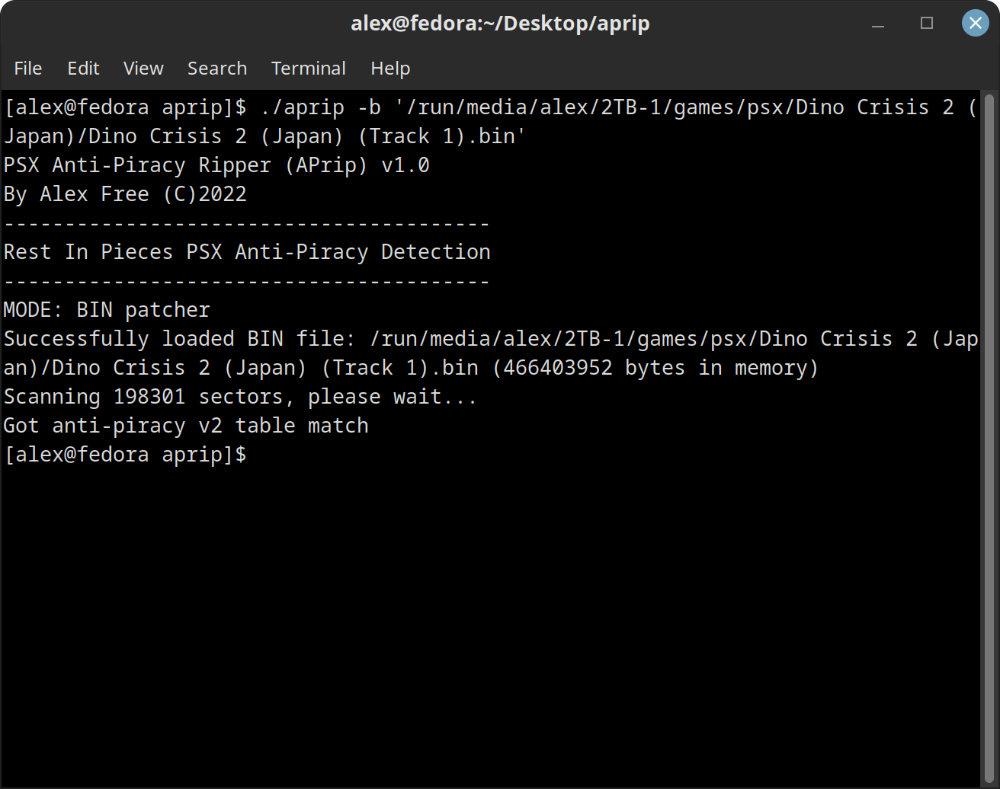

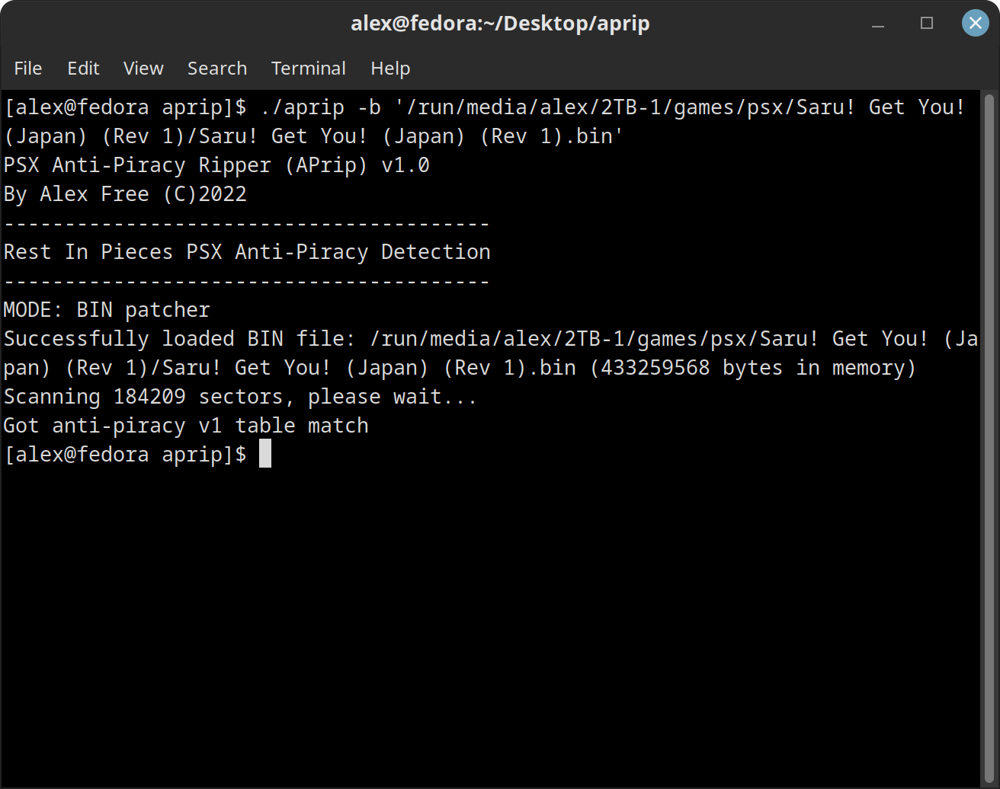

## Generating GameShark Codes

Instead of patching the BIN file directly (or if you have a real import PSX disc), you can generate some GameShark codes which will do the same thing and bypass the additional anti-piracy copy protection. 

You'll need the download the [DuckStation](https://github.com/stenzek/duckstation/releases) emulator. Start the emulator and navigate to the `Advanced` Settings pane. Change your settings pane so it looks like this image below:

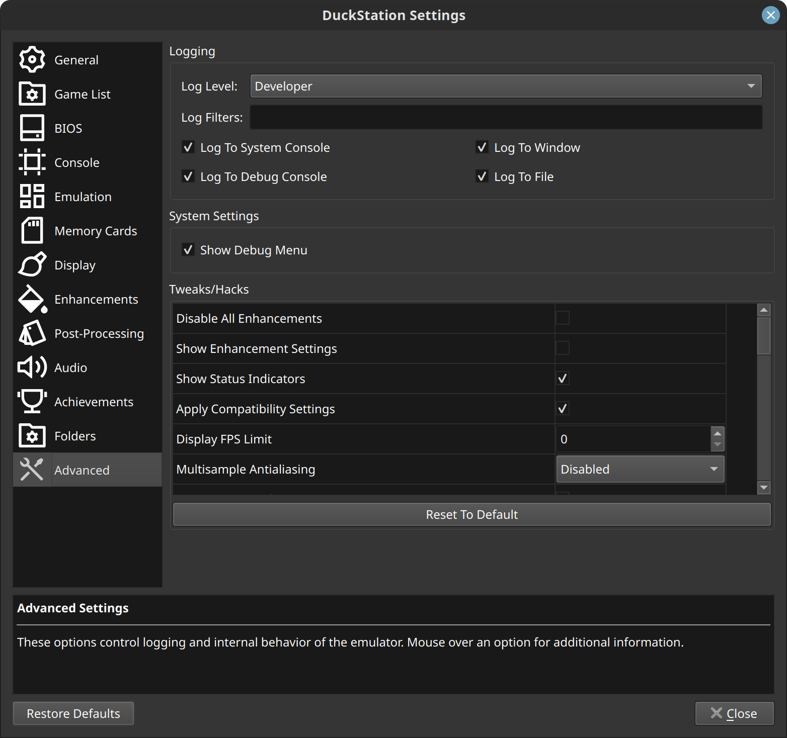

Also, ensure that the _Enable 8MB RAM_ option is **left untouched** as shown in the image below:

Now you can generate some GameShark codes with APrip:

*	Rip or acquire a CD image of your desired game.

*	Make sure you can patch the bin file of the game successfully first (as in you see the text `got APv1 table match` or `got APv2 table match` while APrip is patching the game's BIN file). **If you can't patch the BIN file of a game with APrip, don't bother trying to generate a GameShark code as it won't work**.

*	On Linux, execute `./ap-type-checker.sh <duckstation executable> <game cue file>` in your Terminal. On Windows, execute `ap-type-checker.bat <duckstation executable> <game cue file>`. Replace `<duckstation executable>` with the actual file path of the DuckStation executable. Replace `<game cue file>` with the actual game's cue file that contains additional anti-piracy copy protection.

*	**Monitor the terminal, when you see the ReadTOC command (APv2 game) or first Test command (APv1 game) immediately pause emulation and dump the memory to a file**.

*	On Linux, execute `./aprip -gs <path to mem dump file>` in your Terminal. On Windows, execute `aprip.exe -gs <path to mem dump file>` in `cmd.exe`. Replace `<path to mem dump file` with the actual file path to the memory dump from DuckStation. If you timed your memory dump correctly you will see GameShark codes generated by the output of APrip. _It can be tricky to time this right, you may want to try dumping the memory in Duckstation just a little bit before you see the ReadTOC command being sent in the console log if you can't get codes to generate_.

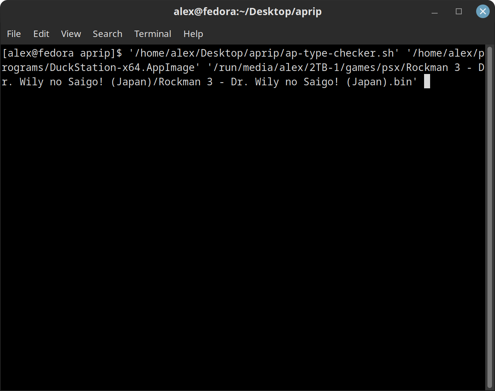

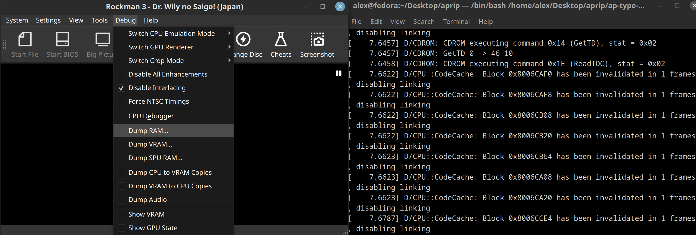

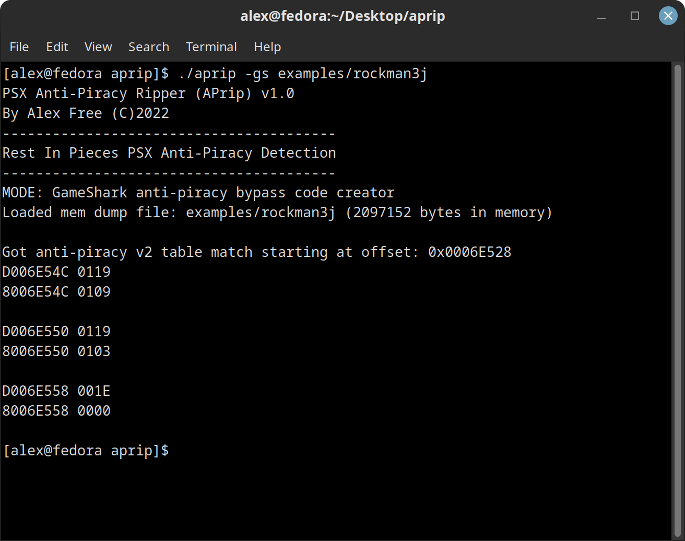

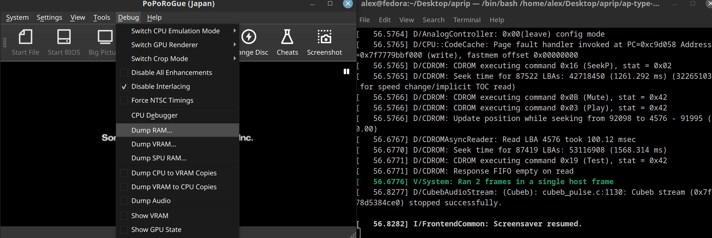

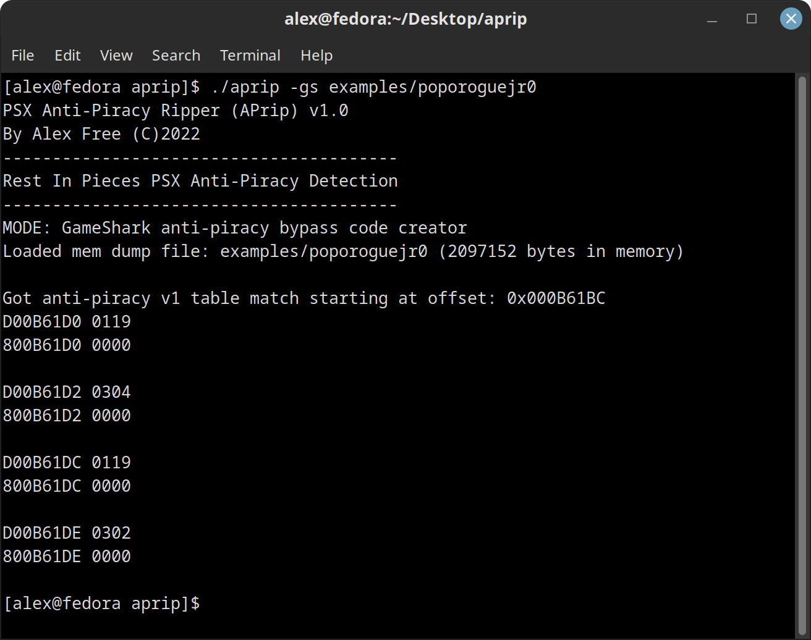

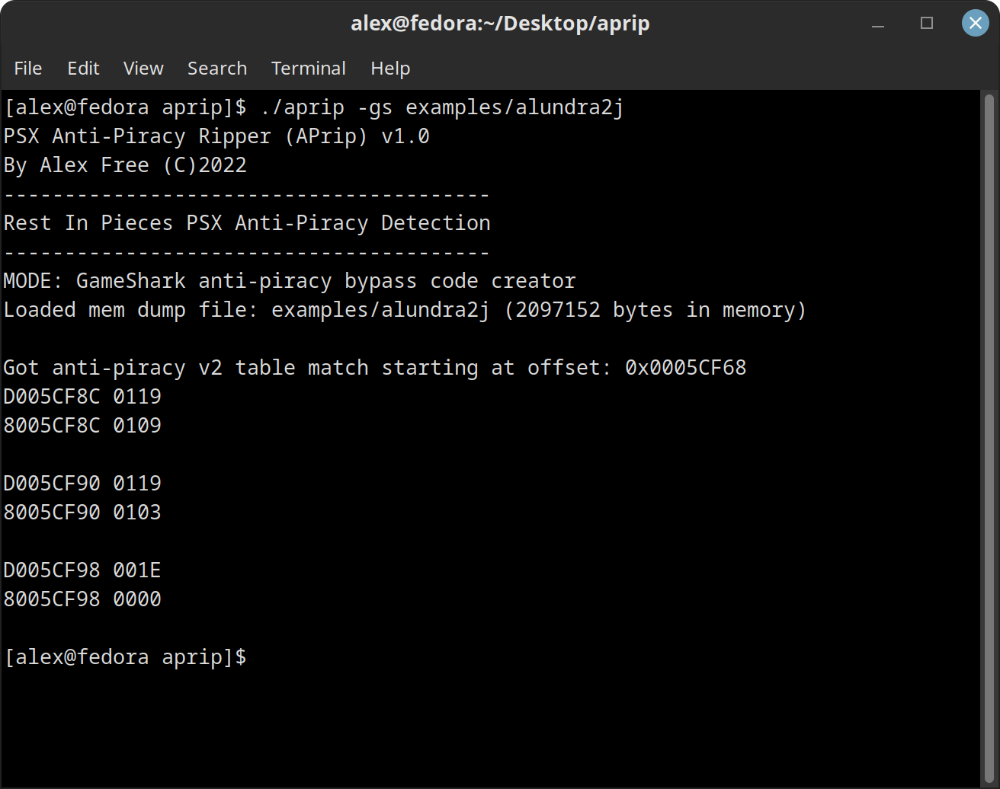

You can use these GameShark codes with a non-stealth modchip if you have an actual GameShark cheat device (with original GameShark software/cheat manager). Simple enter all of the codes generated by APrip and boot the unmodified backup CD-R or import disc containing the game with additional anti-piracy copy protection.

If you have a stock console without a non-stealth modchip, the idea would be to add the **last code** generated by APrip to the [Tonyhax International source code](https://github.com/alex-free/tonyhax/blob/master/loader/patcher.c) and to make [a new build of Tonyhax International](https://alex-free.github.io/tonyhax-international#building-from-source). The **last code** is the only code required to bypass the APv2 additional anti-piracy copy protection for stock consoles with correct TOC data, so it is the only one you need to add to Tonyhax International.

_NOTE:_ You can't use a GameShark cheat device (with original GameShark software/cheat manager) to apply GameShark codes made with APrip and then boot i.e. the Tonyhax International [Boot CD](https://alex-free.github.io/tonyhax-international#boot-cd) because it conflicts with the functionality Tonyhax International uses for various things.

## Converting An Existing GameShark Code

If you have an existing code in this format:

`D0XXXXXX YYYY`

`80XXXXXX YYYY`

And the string of `X`'s in the GameShark code is the same in both the `DO` and `80` lines of the code then you can convert the code to different releases/versions of the same game. This is useful because [back in the day](https://consolecopyworld.com/psx/psx_game_codes.shtml) GameShark codes to bypass additional anti-piracy copy protection were _usually only made for a single version and or the first release of a game_. There is a chance that the same GameShark code code will work with a different version of a game (think a Demo version, Greatest Hits version, or different regional release) but it is certainly not always the case.

The example usage below will explain how the existing Biohazard 3: The Last Escape [Japan Rev 0](http://redump.org/disc/10/) version [code](https://consolecopyworld.com/psx/psx_game_codes_b.shtml) which _completely skips the additional anti-piracy copy protection_ (making it in fact superior to the code generated by APrip since this shortens the load time that would normally occur during the additional anti-piracy copy protection) can be converted by APrip to work on the Biohazard 3: The Last Escape [Japan Demo](http://redump.org/disc/11674/) version.

*	Rip or acquire a CD image of 2 different versions of a game (i.e, BioHazard 3: The Last Escape [Japan Rev 0](http://redump.org/disc/10/) and [Japan Demo](http://redump.org/disc/11674/)).

*	On Linux, execute `./ap-type-checker.sh <duckstation executable> <game cue file>` in your Terminal. On Windows, execute `ap-type-checker.bat <duckstation executable> <game cue file>`. Replace `<duckstation executable>` with the actual file path of the DuckStation executable. Replace `<game cue file>` with the actual game's cue file (do the version of the game you have a code for first) that contains additional anti-piracy copy protection. 

*	**Monitor the terminal, when you see the ReadTOC command (APv2 game) or first Test command (APv1 game) immediately pause emulation and dump the memory to a file**.

*	Once you have dumped the RAM for the version of the game you have a code for, do the exact same _but for the game version you don't have a code for_. You should now have 2 memory dump files.

*	The code we know is for Biohazard 3 Japan Rev 0, which is: [D01840E2 1040 801840E2 1000](https://consolecopyworld.com/psx/psx_game_codes_b.shtml). The first line of the code is the one that is to be input to APrip.

*	On Linux for this example, execute `./aprip D01840E2 1040 <path to old game ver mem dump> <path to new game ver mem dump>` in your Terminal. On Windows, execute `aprip.exe D01840E2 1040 <path to old game ver mem dump> <path to new game ver mem dump>` in `cmd.exe`. Replace `<path to old game ver mem dump>` with the memory dump file from the version of the game you know the code for. Replace `<path to new game ver mem dump>` with the memory dump fiel from the version of the game you don't know/have a code for (yet). 

If you timed your memory dump correctly you will see a new GameShark code line (for the version of the game you didn't have a code for) generated by the output of APrip. _It can be tricky to time this right, you may want to try dumping the memory in Duckstation just a little bit before you see the ReadTOC command being sent in the console log if you can't get codes to generate_.

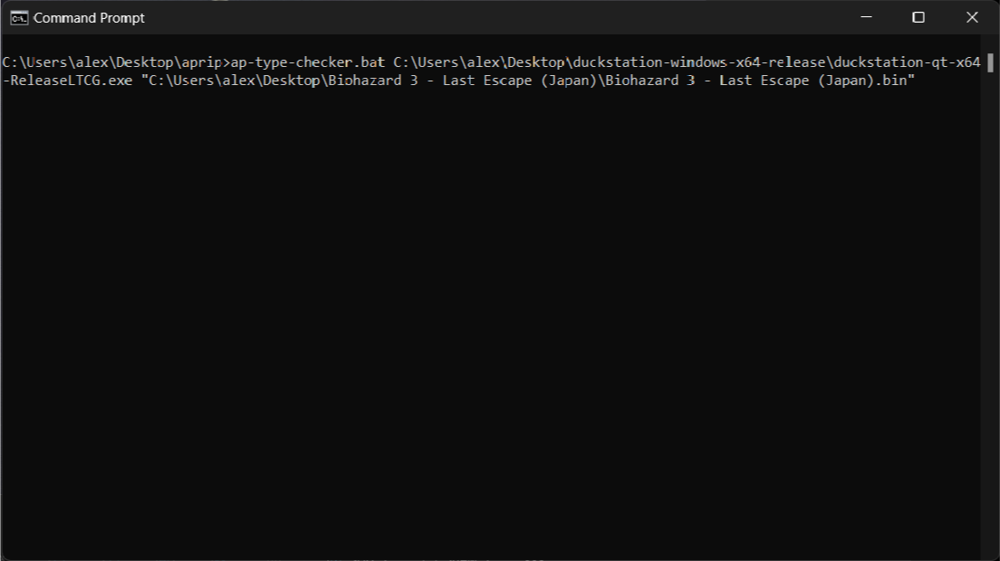

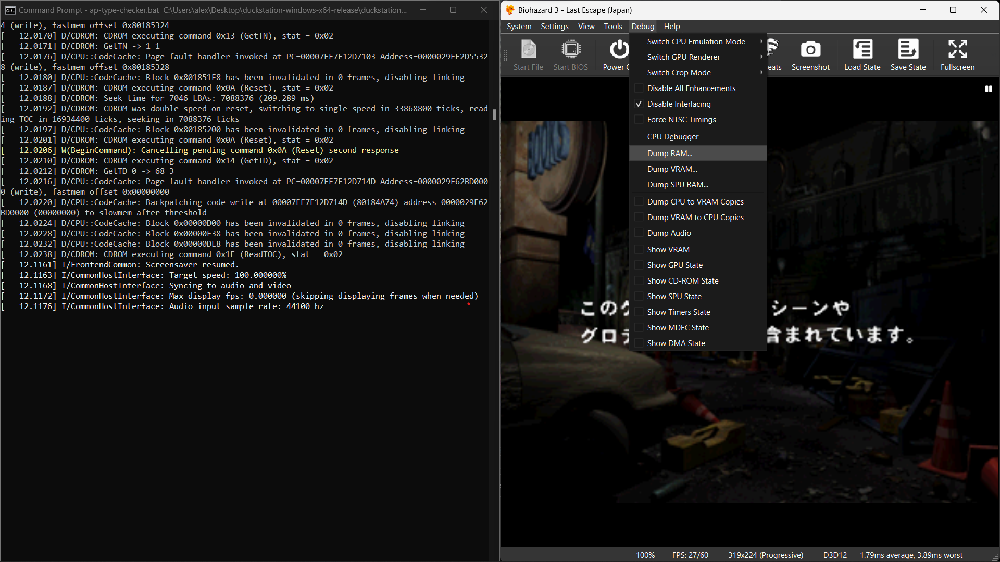

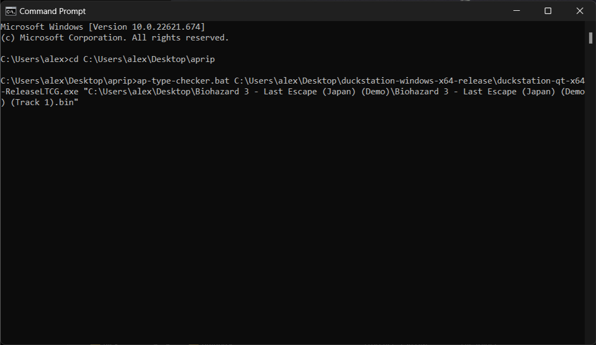

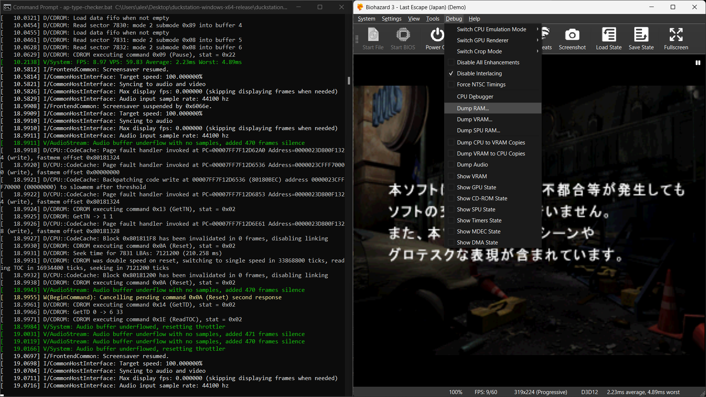

## How It Works

I noticed in the partial [decompilation](https://github.com/socram8888/tonyhax/blob/master/docs/antipiracy.c) of an APv2 style function that the CD commands used at the heart of all the additional anti-piracy copy protection could be identifiable from memory when the checks are being performed. This turned out to be true for most games.

For APv1 style games, the commands we care about are the 19'04 and 19'05 CD Test commands. These detect non-stealth modchips when used together. MottZilla realized these commands could be replaced by the Pause and Play CD commands and the routine would not trigger the anti-piracy screen of death on APv2, however I found this to not work on APv1 style games (the function gets stuck). APrip instead works by replacing the 19'04 and 19'05 CD Test commands entirely (4 bytes total) in memory with 00 bytes. It's that simple, I found it by guessing if it would work.

For APv2 style games, we have one additional command that we care about. The ReadTOC command. This command is really interesting for a few reasons:

*	It resets the CD drive authentication/license status. Usually this is only done when the CD drive door physically opens.

*	This command was implemented to stop the [CD Player Swap Trick](https://alex-free.github.io/tonyhax-international/#boot-cd) found on the original launch PSX consoles from working.

* This command **does not exist in the CDROM Controller BIOS firmware version C0A or C0B**. These CDROM Controller BIOS firmware versions are only found in SCPH-1000 consoles, and in some early SCPH-3000 consoles.

The APv2 style games accommodate for the early Japanese consoles which lack the ReadTOC command. From my understanding, this semi-discreet line of decompiled [code](https://github.com/alex-free/tonyhax/blob/d8f5c5fe4171ecb24a0522bac60b879a2deca4d3/docs/antipiracy.c#L109) is what triggers if the ReadTOC command does not exist. What happens is essentially a fail-safe, the code immediately returns 0 and exits out of the function. **Now this is really interesting**, because this means that if the TOC is correct (Tonyhax International and Stealth ROM ensure this already) then the AP function will always pass, no patching required. And it's true, you can literally burn an unmodified copy of Spyro: Year Of The Dragon (a game APrip can't patch due to it's non-standard implementation of additional anti-piracy copy protection) and if you boot it with Tonyhax International on an early Japanese PSX console that lacks the ReadTOC command it will **just work**. This goes for any other game containing additional anti-piracy copy protection as well, they all just work on a SCPH-1000 or early SCPH-3000 without any patching if you have the correct TOC data.

So this is where I tried something. What happens if we replace the first byte of the ReadTOC command with `00` and leave the rest of the bytes relative to it in the AP code alone? 00 would turn ReadToc into effectively the [Sync](https://problemkaputt.de/psx-spx.htm#cdromcontrollercommandsummary) command, which is actually an invalid command that doesn't do what it's supposed to do according to official documentation. Effectively it turns out this seems to trigger the same behavior as if the console was a SCPH-1000 or early SCPH-3000 that lacked the ReadTOC command, bypassing the APv2 code completely!

## Credits

*	MottZilla: Thanks for letting me know that the 19'04 and 19'05 CD Test commands can be replaced by the Pause and Play CD commands in the table and not trigger the detection on APv2 style functions. MottZilla also wrote the Cheat Engine used to apply GameShark codes in [Tonyhax International](https://alex-free.github.io/tonyhax-international).

*	Socram8888: Thanks for the partial [decompilation](https://github.com/socram8888/tonyhax/blob/master/docs/antipiracy.c) of an APv2 style anti-piracy function, found in the docs folder of the original [Tonyhax](https://github.com/socram8888/). This is what inspired and gave me the ability to write APrip.