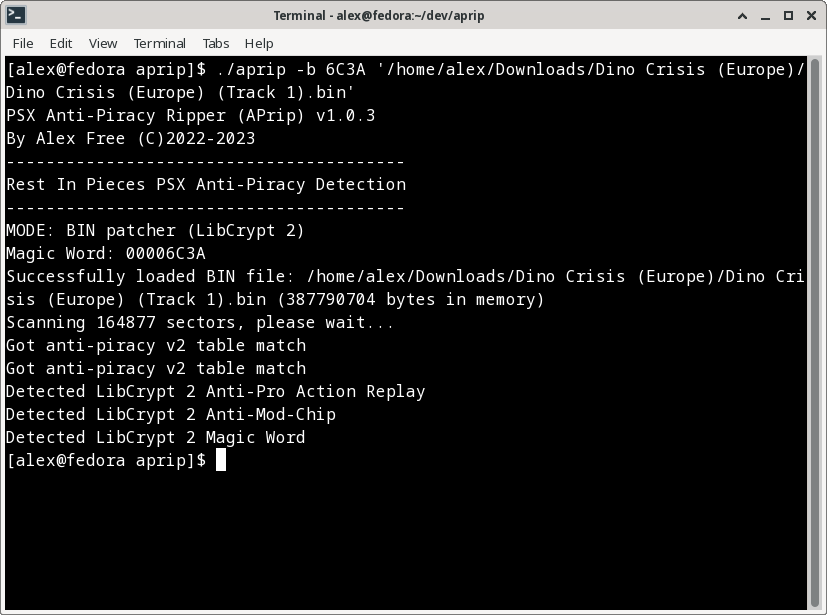
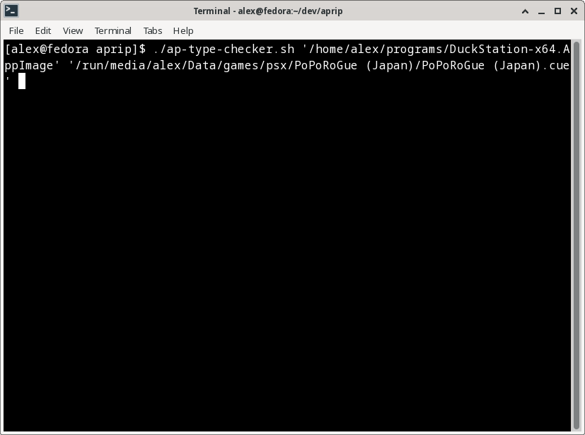
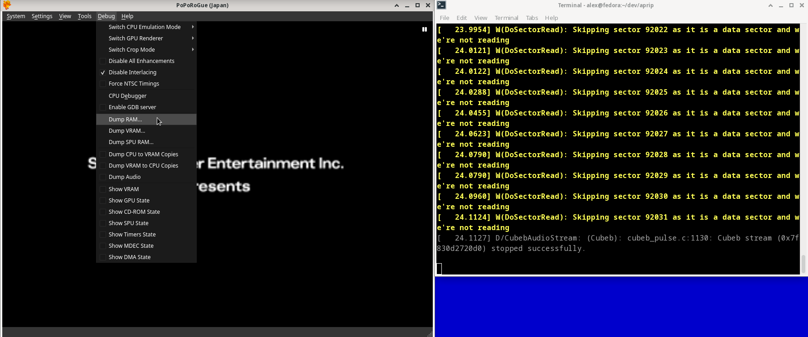

# [alex-free.github.io](https://alex-free.github.io)

# APrip: Rip Out Additional anti-piracy copy protection Found In Later PSX Games.

By Alex Free

APrip is a portable open source tool capable of bypassing/patching-out the various 'standardized' additional anti-piracy copy protection implementations found in some later PSX games. The goal of APrip is to enable the use of [standard CD burning software](#standard-cd-burning-software) with BIN+CUE CD images to enable play of burned CD-R game discs using either a non-stealth mod-chip or a [modern soft-mod](#modern-soft-mod). It accomplishes this by using [multiple generic patching methods](#how-it-works) (no hard-coded values) in an attempt to become the ultimate all in one anti-piracy patching solution for the PSX.

## Usage

*   [Anti-Piracy Types & Support](#anti-piracy-types--support)
*   [Patching The CD Image](#patching-the-cd-image)
*   [Generating GameShark Codes](#generating-gameshark-codes)
*   [Converting An Existing GameShark Codes](#converting-an-existing-gameshark-code).

_More Info_

*   [Modern Soft-Mods](#modern-soft-mods)
*   [Standard CD Burning Software](#standard-cd-burning-software)
*   [How It Works](#how-it-works)
*   [License](#license)
*   [Credits](#credits)

## Downloads

### Version 1.0.3 (6/22/2023)

*	[aprip-1.0.3-windows-x86](https://github.com/alex-free/aprip/releases/download/v1.0.3/aprip-1.0.3-windows_x86.zip) _For Windows 95 OSR 2.5 Or Newer (32-bit Windows)_
*	[aprip-1.0.3-windows-x86_64](https://github.com/alex-free/aprip/releases/download/v1.0.3/aprip-1.0.3-windows_x86_64.zip) _For 64-bit Windows_
*	[aprip-1.0.3-linux-x86](https://github.com/alex-free/aprip/releases/download/v1.0.3/aprip-1.0.3-linux_x86_static.zip) _For x86 Linux Distros_
*	[aprip-1.0.3-linux-x86_64](https://github.com/alex-free/aprip/releases/download/v1.0.3/aprip-1.0.3-linux_x86_64_static.zip) _For x86_64 Linux Distros_
*	[aprip-1.0.3-source](https://github.com/alex-free/aprip/archive/refs/tags/v1.0.3.zip)

Changes:

*	Added support for LibCrypt 2 CD image patching.

*   Substantial documentation rewrite.

[About Previous Versions](changelog.md).

## Links

*	[Homepage](https://alex-free.github.io/aprip)
*	[Github](https://github.com/alex-free/aprip)
*	[Tonyhax International](https://alex-free.github.io/tonyhax-international)
*	[Tonyhax International APv2 Bypass System](https://alex-free.github.io/tonyhax-international/anti-piracy-bypass.html)
*   [FF VIII APv1 In-Depth](https://consolecopyworld.com/psx/psx_ff8_protection.shtml)

## Anti-Piracy Types & Support

Starting in late 1998, some specific PSX games began implementing additional copy protection designed to prevent playing backup CD-R copies or import discs of said game. Different types of additional copy protection have been found in PSX games over the years:

### APv1

The very first kind of 'standardized' additional copy protection that appeared first in the Japan only game [PoPoRogue](http://redump.org/disc/1552/). This protection does the following checks:

*   19'04/19'05 test commands to check for SCEX spamming

Affects: Non-stealth mod-chips (that constantly spam SCEX string to CDROM controller). **Does not affect [modern soft-mods](#modern-soft-mod).**

### APv1.5

A slight tweak was made after the embarrassment of how trivial it was to bypass the PoPoRogue Japan protection via a stock console using a swap trick. This upgraded protection checks for the expected TOC data to be returned for the current disc (number of tracks on disc, and length of each track) which would be invalid with a traditional swap trick. This protection was seen in the Japan release [Vandal Harts II](http://redump.org/disc/4854/), although I'm quite unsure what the first game to 'upgrade' from APv1 was. The protection has the following checks:

*   19'04/19'05 test commands to check for SCEX spamming
*   GetTN/GetTD commands to check TOC data validity.

Affects: Non-stealth mod-chips and traditional swap tricks. **Does not affect [modern soft-mods](#modern-soft-mod).**

### APv2

This protection was first seen in probably in the Japan release of [Dino Crisis](http://redump.org/disc/1598/). This protection has the following checks:

*   19'04/19'05 test commands to check for SCEX spamming
*   GetTN/GetTD commands to check TOC data validity.
*   ReadTOC to reauthenticate SCEX data to enforce region/copy protection validity.

Affects: Non-stealth mod-chips, swap tricks, **[modern soft-mods](#modern-soft-mods) without explicit support for bypassing it.**

There is an explicit backdoor in the APv1 protection so that it succeeds on SCPH-1000 and early SCPH-3000 consoles which lack the ReadTOC command in the CDROM Controller firmware versions C0A and C0B. If the TOC data is correct (which [modern soft-mods](#modern-soft-mods) guarantee on game boot) this protection will effectively disable itself as long as a non-stealth mod-chip is installed. For more info on this (which is what inspired APrip in the first place), see the [How It Works](#how-it-works) section.

### APv1/APv1.5/APv2 APrip Patch Success Rate

[GameShark codes generation](#generating-gameshark-codes) seems to have a 100% success rate. 

[CD Image Patching](#patching-the-cd-image) is confirmed less then 100%, although it is unknown how many don't work. The CD patching method is not 100% because some games appear to obfuscate the code in the CD image. APv1.5 also seems to have varying code for the checks which the patching methods miss.

### LibCrypt v1

LibCrypt was first introduced in the European releases of [MediEvil](http://redump.org/disc/592/), this is a completely different type of protection from what was previously seen with APv1/Apv1.5/Apv2. It was [first patched](https://consolecopyworld.com/psx/psx_medievil.shtml) almost immedietly after it's introduction. It has the following check:

*   Verifies a [16-bit key based on invalid SubChannel data](https://red-j.github.io/Libcrypt-PS1-Protection-bible/index.htm) which is 'corrected' to valid data (which mis-matches what the game executable expect) when a ripped image is burned back to a CD-R. The European releases of MediEvil are the only games with this version of LibCrypt, all future SCEE European PSX titles that have LibCrypt have a newer version which works differently.

Affects: Booting a CD-R burned by normal software in BIN/CUE format. No soft-mod currently bypasses this 'on the fly'.

Aprip does not yet support patching LibCrypt v1, but it will definitely be added shortly in an update coming soon.

### LibCrypt v2

This is reportedly the version of LibCrypt used by almost all titles using this type of protection, which has the following checks:

*   Verifies a [16-bit key based on invalid SubChannel data](https://red-j.github.io/Libcrypt-PS1-Protection-bible/index.htm) which is 'corrected' to valid data (which mis-matches what the game executable expect) when a ripped image is burned back to a CD-R.

*   Checks for Pro Action Replay.
*   Checks for non-stealth mod-chip which is spamming SCEX data.

Affects: Booting a CD-R burned by normal software in BIN/CUE format, consoles with Pro Action Replay in-use, swap tricks, and non-stealth mod-chips booting said CD-R. No soft-mod currently bypasses this 'on the fly'.

APrip does have support for patching the [CD Image](#patching-the-cd-image) to enable games containing LibCrypt v22 protections to be burned with standard burning software and to allow them to be used on any console, via any boot method (be that soft-mod or hard-mod). Unsure yet how compatible this is across all games with LibCrypt v2.

### LibCrypt v3

This version of LibCrypt is used in later titles containing the protection, all functions in the game executable are 'encrypted'. Besides that it is reportedly similar in functionality:

*   Verifies a [16-bit key based on invalid SubChannel data](https://red-j.github.io/Libcrypt-PS1-Protection-bible/index.htm) which is 'corrected' to valid data (which mis-matches what the game executable expect) when a ripped image is burned back to a CD-R.

*   Checks for Pro Action Replay.
*   Checks for non-stealth mod-chip which is spamming SCEX data.

Affects: Booting a CD-R burned by normal software in BIN/CUE format, consoles with Pro Action Replay in-use, swap tricks, and non-stealth mod-chips booting said CD-R. No soft-mod currently bypasses this 'on the fly'.

Aprip does not yet support patching LibCrypt v3, and don't hold your breath for it either.

### LibCrypt v4

This is the very last version of LibCrypt used in the European game [F1 2000](http://redump.org/disc/48119/). It uses 45 total functions in 9 different modules (all encrypted) to check the validity of the CD. It does not have a magic word however, unlike previous versions of the protection.

*   Verifies a [32-bit key hardcoded](https://red-j.github.io/Libcrypt-PS1-Protection-bible/index.htm) which is 'corrected' to valid data (which mis-matches what the game executable expect) when a ripped image is burned back to a CD-R.
*   Checks for Pro Action Replay.
*   Checks for non-stealth mod-chip which is spamming SCEX data.

Affects: Booting a CD-R burned by normal software in BIN/CUE format, consoles with Pro Action Replay in-use, swap tricks, and non-stealth mod-chips booting said CD-R. No soft-mod currently bypasses this 'on the fly'.

Aprip does not yet support patching LibCrypt v4, but honestly I'll probably get around to adding it.

### EDC

In addition to APv1 or APv2 protection, some later games may also contain a protection measure known as the EDC check. For the affected games, this protection is triggered when you burn the EDC protected PSX CD image with standard CD burning software, which in most cases will changes the EDC data when burning an EDC protected PSX CD image. This is very similar to LibCrypt, but it is not as hard to bypass as instead of using SubChannel data, it's only using EDC data.

The EDC check can be defeated by simply forcing the EDC data to not be changed when burning such a protected PSX CD image. Not every CD burning software has an option which can do this, and I'm not sure if I'll get around to implementing patching support as I doubt this anywhere close to generic.

## Modern Soft-Mods

These PSX soft-mods are capable of correctly playing APrip patched CD-Rs:

* [Stealth Unlocker](https://www.psxdev.net/forum/viewtopic.php?t=3966)
* [Tonyhax International](https://alex-free.github.io/tonyhax-international)
* [Tonyhax](https://orca.pet/tonyhax/)
* [UniROM](https://unirom.github.io/) _Note:_ SCPH-1000/SCPH-3000 not properly supported by the current version as of 6/22/2023.

## Standard CD Burning Software

APrip patched disc images can be burned by _any CD burning software that regenerates EDC protection on the fly_. If you don't know what this is, you probably have it already. Such popular software includes:

*   [ImgBurn](https://www.imgburn.com/)
*   [CDRDAO](https://cdrdao.sourceforge.net/)

## Patching The CD Image

APrip can take some time to patch a BIN file as it has to scan the entire file. Depending on how fast the computer you run APrip on is (and how big the BIN file is), this may take a literal minute or 2 to complete. Maybe more for slower systems. APrip is **not using any hardcoded patches, it is using a new more dynamic flexible patching method**.

*	Rip or acquire a CD image of your desired game.

### For APv1/APv1.5/APv2

*	On Linux, execute `./aprip -b <track 01.bin>` in your Terminal. On Windows, execute  `aprip.exe -b <track 01.bin>` in `cmd.exe`. _Replace `<track 01.bin>` with the actual first or only data track from the game you want to patch_.

*	If you see `got APv1 table match` or `got APv2 table match` then congratulations, the game can no longer detect a non-stealth modchip or [modern soft-mod](#modern-soft-mods). _Traditional Swap tricks with APv1.5 or APv2 will still trigger the detection however_.

### For LibCrypt 2

*	On Linux, execute `./aprip -b <magic word> <track 01.bin>` in your Terminal. On Windows, execute  `aprip.exe -b <magic word> <track 01.bin>` in `cmd.exe`. _Replace `<track 01.bin>` with the actual first or only data track from the game you want to patch_. Replace `<magic word>` with the correct magic word (MW:), which you can find from the [PS1 Custom Patches](https://www.psdevwiki.com/ps3/PS1_Custom_Patches) page on the PS3 Dev Wiki among other places.

*	If you see:

`Detected LibCrypt 2 Anti-Pro Action Replay`

`Detected LibCrypt 2 Anti-Mod-Chip`

`Detected LibCrypt 2 Magic Word`

then congratulations, the game will work when burned with normal CD burning software.

*	Burn the `*.cue` file which corresponds to your patched `<track 01.bin>` file to a CD-R.

*	Boot your CD-R with any method on your console.

## Generating GameShark Codes

Instead of patching the BIN file directly (or if you have a real import PSX disc), you can generate some GameShark codes which will do the same thing and bypass the additional anti-piracy copy protection. This method actually has a much higher (if not 100% success rate) compared to the [Patching CD Images](#patching-the-cd-image) method, since some CD images are obfuscating the anti-piracy code (but not at run-time in RAM).

You'll need the download the [DuckStation](https://github.com/stenzek/duckstation/releases) emulator. Start the emulator and navigate to the `Advanced` Settings pane. Change your settings pane so it looks like this image below:

Also, ensure that the _Enable 8MB RAM_ option is **left untouched** as shown in the image below:

Now you can generate some GameShark codes with APrip:

*	Rip or acquire a CD image of your desired game.

*	Make sure you can patch the bin file of the game successfully first (as in you see the text `got APv1 table match` or `got APv2 table match` while APrip is patching the game's BIN file). **If you can't patch the BIN file of a game with APrip, don't bother trying to generate a GameShark code as it won't work**.

*	On Linux, execute `./ap-type-checker.sh <duckstation executable> <game cue file>` in your Terminal. On Windows, execute `ap-type-checker.bat <duckstation executable> <game cue file>`. Replace `<duckstation executable>` with the actual file path of the DuckStation executable. Replace `<game cue file>` with the actual game's cue file that contains additional anti-piracy copy protection.

*	**Monitor the terminal, when you see the yellow text `as it is a data sector and we're not reading` immediately pause emulation and dump the memory to a file**.

*	On Linux, execute `./aprip -gs <path to mem dump file>` in your Terminal. On Windows, execute `aprip.exe -gs <path to mem dump file>` in `cmd.exe`. Replace `<path to mem dump file` with the actual file path to the memory dump from DuckStation. If you timed your memory dump correctly you will see GameShark codes generated by the output of APrip. _It can be tricky to time this right, you may want to try dumping the memory in Duckstation just a little bit before you see the ReadTOC command being sent in the console log if you can't get codes to generate_.

You can use these GameShark codes with a non-stealth modchip if you have an actual GameShark cheat device (with original GameShark software/cheat manager). Simple enter all of the codes generated by APrip and boot the unmodified backup CD-R or import disc containing the game with additional anti-piracy copy protection.

_NOTE:_ You can't use a GameShark cheat device (with original GameShark software/cheat manager) to apply GameShark codes made with APrip and then boot i.e. the Tonyhax International [Boot CD](https://alex-free.github.io/tonyhax-international#boot-cd) because it conflicts with the functionality Tonyhax International uses for various things. Instead, just use the recently adding [GameShark Support](https://alex-free.github.io/tonyhax-international/gameshark-code-support.html) in Tonyhax International itself.

## Converting An Existing GameShark Code

If you have an existing code in this format:

`D0XXXXXX YYYY`

`80XXXXXX YYYY`

And the string of `X`'s in the GameShark code is the same in both the `DO` and `80` lines of the code then you can convert the code to different releases/versions of the same game. This is useful because [back in the day](https://consolecopyworld.com/psx/psx_game_codes.shtml) GameShark codes to bypass additional anti-piracy copy protection were _usually only made for a single version and or the first release of a game_. There is a chance that the same GameShark code code will work with a different version of a game (think a Demo version, Greatest Hits version, or different regional release) but it is certainly not always the case.

The example usage below will explain how the existing Biohazard 3: The Last Escape [Japan Rev 0](http://redump.org/disc/10/) version [code](https://consolecopyworld.com/psx/psx_game_codes_b.shtml) which _completely skips the additional anti-piracy copy protection_ (making it in fact superior to the code generated by APrip since this shortens the load time that would normally occur during the additional anti-piracy copy protection) can be converted by APrip to work on the Biohazard 3: The Last Escape [Japan Demo](http://redump.org/disc/11674/) version.

*	Rip or acquire a CD image of 2 different versions of a game (i.e, BioHazard 3: The Last Escape [Japan Rev 0](http://redump.org/disc/10/) and [Japan Demo](http://redump.org/disc/11674/)).

*	On Linux, execute `./ap-type-checker.sh <duckstation executable> <game cue file>` in your Terminal. On Windows, execute `ap-type-checker.bat <duckstation executable> <game cue file>`. Replace `<duckstation executable>` with the actual file path of the DuckStation executable. Replace `<game cue file>` with the actual game's cue file (do the version of the game you have a code for first) that contains additional anti-piracy copy protection. 

*	**Monitor the terminal, when you see the yellow text `as it is a data sector and we're not reading` immediately pause emulation and dump the memory to a file**. This timing can vary however depending on the game or code, although the above method is very reliable. As seen below, the timing doesn't have to be super precise for Biohazard 3.

*	Once you have dumped the RAM for the version of the game you have a code for, do the exact same _but for the game version you don't have a code for_. You should now have 2 memory dump files.

*	The code we know is for Biohazard 3 Japan Rev 0, which is: [D01840E2 1040 801840E2 1000](https://consolecopyworld.com/psx/psx_game_codes_b.shtml). The first line of the code is the one that is to be input to APrip.

*	On Linux for this example, execute `./aprip D01840E2 1040 <path to old game ver mem dump> <path to new game ver mem dump>` in your Terminal. On Windows, execute `aprip.exe D01840E2 1040 <path to old game ver mem dump> <path to new game ver mem dump>` in `cmd.exe`. Replace `<path to old game ver mem dump>` with the memory dump file from the version of the game you know the code for. Replace `<path to new game ver mem dump>` with the memory dump fiel from the version of the game you don't know/have a code for (yet). 

If you timed your memory dump correctly you will see a new GameShark code line (for the version of the game you didn't have a code for) generated by the output of APrip. _It can be tricky to time this right, you may want to try dumping the memory in Duckstation just a little bit before you see the ReadTOC command being sent in the console log if you can't get codes to generate_.

## How It Works

### APv1/APv1.5/APv2
I noticed in the partial [decompilation](https://github.com/socram8888/tonyhax/blob/master/docs/antipiracy.c) of an APv2 style function that the CD commands used at the heart of all the additional anti-piracy copy protection could be identifiable from memory when the checks are being performed. This turned out to be true for most games.

For APv1/APv1.5 style games, the commands we care about are the 19'04 and 19'05 CD Test commands. These detect non-stealth modchips when used together. MottZilla realized these commands could be replaced by the Pause and Play CD commands and the routine would not trigger the anti-piracy screen of death on APv2, however I found this to not work on APv1 style games (the function gets stuck). APrip instead works by replacing the 19'04 and 19'05 CD Test commands entirely (4 bytes total) in memory with 00 bytes. It's that simple, I found it by guessing if it would work.

For APv2 style games, we have one additional command that we care about. The ReadTOC command. This command is really interesting for a few reasons:

*	It resets the CD drive authentication/license status. Usually this is only done when the CD drive door physically opens.

*	This command was implemented to stop the [CD Player Swap Trick](https://alex-free.github.io/tonyhax-international/#boot-cd) found on the original launch PSX consoles from working.

* This command **does not exist in the CDROM Controller BIOS firmware version C0A or C0B**. These CDROM Controller BIOS firmware versions are only found in SCPH-1000 consoles, and in some early SCPH-3000 consoles.

The APv2 style games accommodate for the early Japanese consoles which lack the ReadTOC command. From my understanding, this semi-discreet line of decompiled [code](https://github.com/alex-free/tonyhax/blob/d8f5c5fe4171ecb24a0522bac60b879a2deca4d3/docs/antipiracy.c#L109) is what triggers if the ReadTOC command does not exist. What happens is essentially a fail-safe, the code immediately returns 0 and exits out of the function. **Now this is really interesting**, because this means that if the TOC is correct (Tonyhax International and Stealth ROM ensure this already) then the AP function will always pass, no patching required. And it's true, you can literally burn an unmodified copy of Spyro: Year Of The Dragon (a game APrip can't patch due to it's non-standard implementation of additional anti-piracy copy protection) and if you boot it with Tonyhax International on an early Japanese PSX console that lacks the ReadTOC command it will **just work**. This goes for any other game containing additional anti-piracy copy protection as well, they all just work on a SCPH-1000 or early SCPH-3000 without any patching if you have the correct TOC data.

So this is where I tried something. What happens if we replace the first byte of the ReadTOC command with `00` and leave the rest of the bytes relative to it in the AP code alone? 00 would turn ReadToc into effectively the [Sync](https://problemkaputt.de/psx-spx.htm#cdromcontrollercommandsummary) command, which is actually an invalid command that doesn't do what it's supposed to do according to official documentation. Effectively it turns out this seems to trigger the same behavior as if the console was a SCPH-1000 or early SCPH-3000 that lacked the ReadTOC command, bypassing the APv2 code completely!

### LibCrypt v2

Using the functions developed for the intial APv1/APv1.5/APv2 patching, I was easily able to automate the hex editing guide written at the [LibCrypt PS1 Protection Bible By Red-J](https://red-j.github.io/Libcrypt-PS1-Protection-bible/index.htm).

## License

APrip is released as open source software under the 3-BSD license. Please see the file `license.txt` in each release for more info.

## Credits

*	MottZilla: Thanks for letting me know that the 19'04 and 19'05 CD Test commands can be replaced by the Pause and Play CD commands in the table and not trigger the detection on APv2 style functions. MottZilla also wrote the Cheat Engine used to apply GameShark codes in [Tonyhax International](https://alex-free.github.io/tonyhax-international).

*	Socram8888: Thanks for the partial [decompilation](https://github.com/socram8888/tonyhax/blob/master/docs/antipiracy.c) of an APv2 style anti-piracy function, found in the docs folder of the original [Tonyhax](https://github.com/socram8888/). This is what inspired and gave me the ability to write APrip.