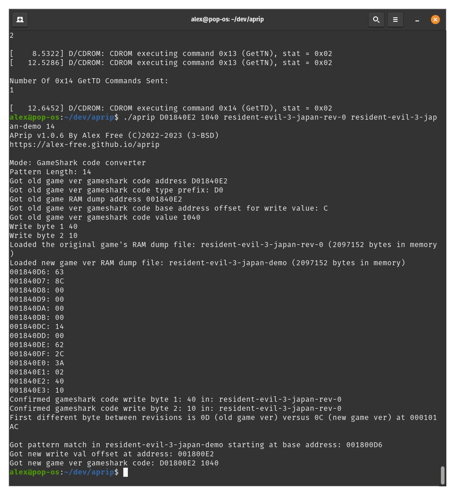

# APrip: PSX Anti-Piracy Protection Bypass Generator

_By Alex Free_

APrip Bypasses various anti-piracy schemes found in later PSX games with CD image generic patch finder and GameShark code generator functions. It can also convert existing GameShark bypass codes to different revisions of the same game, or a different game in the same series.

It is used as a development aid for the Tonyhax International [anti-piracy bypass system](https://alex-free.github.io/tonyhax-international/anti-piracy-bypass.html), however it includes many features that may be of use to others.

## Table Of Contents

*   [Downloads](#downloads)
*   [Anti-Piracy Implementations](#anti-piracy-implementations)
*   [Patching The CD Image](#patching-the-cd-image)
*   [Generating GameShark Codes](#generating-gameshark-codes)
*   [Converting An Existing GameShark Codes](#converting-an-existing-gameshark-code).
*   [Soft-Mods](#soft-mod)
*   [How It Works](#how-it-works)
*   [License](#license)
*   [Credits](#credits)

## Links

*	[Homepage](https://alex-free.github.io/aprip)
*	[Github](https://github.com/alex-free/aprip)
*	[Tonyhax International](https://alex-free.github.io/tonyhax-international)
*	[Tonyhax International APv2 Bypass System](https://alex-free.github.io/tonyhax-international/anti-piracy-bypass.html)
*   [FF VIII APv1 Reversing](https://consolecopyworld.com/psx/psx_ff8_protection.shtml)
*   [MediEvil LibCrypt v1 Reversing](https://consolecopyworld.com/psx/psx_medievil.shtml)
*   [LibCrypt PS1 Protection Bible](https://red-j.github.io/Libcrypt-PS1-Protection-bible/index.htm)
*   [APv2 Decomp/Reversing By Socram8888](https://github.com/socram8888/tonyhax/blob/master/docs/ap_v2.c)

## Downloads

### Version 1.0.7 (4/2/2024)

Changes:

*   Implemented Append No Swap Bypass (By  mdmdj) for disc image patcher mode. This only currently supports the [Append Discs](https://remywiki.com/APPEND_DISC) [Beat Mania Append GottaMix](http://redump.org/disc/3550/) and [Beat Mania Append 3rdMix](http://redump.org/disc/2306/), allowing them to work without a [Key Disc](https://remywiki.com/KEY_DISC).

*   Implemented my new [EzRe](https://github.com/alex-free/ezre) build system.

----------------------------------------------------

*	[aprip-v1.0.7-windows-i686-static.zip](https://github.com/alex-free/aprip/releases/download/v1.0.7/aprip-v1.0.7-windows-i686-static.zip) _Portable Release For Windows 95 OSR 2.5 and above, Pentium CPU minimum (32 bit)_

*	[aprip-v1.0.7-windows-x86\_64-static.zip](https://github.com/alex-free/aprip/releases/download/v1.0.7/aprip-v1.0.7-windows-x86_64-static.zip) _Portable Release For x86_64 Windows (64 bit)_

*	[aprip-v1.0.7-linux-i386-static.zip](https://github.com/alex-free/aprip/releases/download/v1.0.7/aprip-v1.0.7-linux-i386-static.zip) _Portable Release For Linux 3.2.0 and above, 386 CPU minimum (32 bit)_

*	[aprip-v1.0.7-linux-i386-static.deb](https://github.com/alex-free/aprip/releases/download/v1.0.7/aprip-v1.0.7-linux-i386-static.deb) _Deb package file For Linux 3.2.0 and above, 386 CPU minimum (32 bit)_

*	[aprip-v1.0.7-linux-x86\_64-static.zip](https://github.com/alex-free/aprip/releases/download/v1.0.7/aprip-v1.0.7-linux-x86_64-static.zip) _Portable Release For x86\_64 Linux 3.2.0 and above (64 bit)_

*	[aprip-v1.0.7-linux-x86\_64-static.deb](https://github.com/alex-free/aprip/releases/download/v1.0.7/aprip-v1.0.7-linux-x86_64-static.deb) _Deb package file for x86_64 Linux 3.2.0 and above (64 bit)_

---------------------------------------

[About Previous Versions](changelog.md).

## Anti-Piracy Implementations

Starting in late 1998, some specific PSX games began implementing additional copy protection designed to prevent playing backup CD-R copies or import discs of said game. Different types of additional copy protection have been found in PSX games over the years. Below is more info on the 4 different anti-piracy protection schemes aprip currently supports:

### APv1

The very first kind of additional anti-piracy copy protection that appeared was in the Japanese game [PoPoRogue](http://redump.org/disc/1552/). It is only found in various Japanese PSX games, no other region saw any game release with it. 

Trips non-stealth mod-chip consoles: Yes.
Trips Unmodified soft-modded consoles: No.
APrip bypasses For APv1: [Zero Bypass](#zero-bypass).

### APv2

This protection was first seen in the japanese release of [Dino Crisis](http://redump.org/disc/1598/). It is found in various PSX games spanning every region, not just in Japan like the original APv1 protection was limited to. 

Trips non-stealth mod-chip consoles: Yes.
Trips Unmodified soft-modded consoles: Yes.
APrip bypasses for APv2: [Fake PAL BIOS](#fake-pal-bypass) and [Fake VC0](#fake-vc0).

### LibCrypt v1

The first version of LibCrypt (which prevents backup CD-Rs made with most standard burning programs from working), only found in the PAL region releases of MediEvil, listed below:

*   [MediEvil Europe](http://redump.org/disc/592/)
*   [MediEvil France](http://redump.org/disc/13389/)
*   [MediEvil Germany](http://redump.org/disc/25542/)
*   [MediEvil Italy](http://redump.org/disc/29475/)
*   [MediEvil Spain](http://redump.org/disc/1584/)

APrip bypasses For LibCrypt v1: [Icepick Bypass](#icepick-bypass).

### LibCrypt v2

This is a serious upgrade to LibCrypt v1. Not only does it check for evidence that the running game is a burned backup copy, it checks for non-stealth mod-chips and the presence of a Pro Action Replay cheat device installed to the console. This version of LibCrypt is the most common version of the protection. 

APrip bypasses For LibCrypt v2: [B.A.D Bypass](#bad-bypass).

## Soft-Mods

These PSX soft-mods are capable of correctly playing APrip [patched BIN+CUE CD images](#patching-the-cd-image):

* [Stealth Unlocker](https://www.psxdev.net/forum/viewtopic.php?t=3966)

* [Tonyhax International](https://alex-free.github.io/tonyhax-international)

* [Tonyhax](https://orca.pet/tonyhax/)

* [UniROM](https://unirom.github.io/)

Out of the above, all except UniROM have anti-piracy bypass systems implemented for at least some games (and dare I say Tonyhax International's supported bypasses are [quite extensive](https://alex-free.github.io/tonyhax-international/anti-piracy-bypass.html#apv2-bypasses)). 

For any games which don't have a bypass implemented, APrip is here to save the day. [Tonyhax International](https://alex-free.github.io/tonyhax-international) even has a [GameShark feature](https://alex-free.github.io/tonyhax-international/gameshark-code-support.html) that allows you to use [APrip generated GameShark codes](#generating-gameshark-codes).

There are no guarantees that aprip bypasses will work on something like the PSX Change v2, Swap Magic Disc, or similar due to those not updating TOC data before booting the discs.

Besides the Fake VC0 Bypass, all other bypasses do support non-stealth mod-chip consoles.

## Patching The CD Image

APrip can patch the CD image BIN file, as long as the protection is not obfuscated by compression or encryption. If you are unable to patch the CD image you should try generating [Gameshark codes](#generating-gameshark-codes), which work around any such obfuscation entirely.

CD image is slow as it has to scan the entire file for the various protections. Depending on how fast the computer you run APrip on is (and how big the BIN file is), this may take a literal minute or 2 to complete. Maybe more for slower systems.

The first thing to do is to rip and or acquire a CD image of your desired game using any CD ripping software of your choice. Then depending on what protection the game requires, follow the instructions below for either APv2 or LibCrypt v1/LibCrypt v2.

### For APv1 or APv2, Or No-Swap

*	On Linux, execute `./aprip -b <track 01.bin>` in your Terminal. On Windows, execute  `aprip.exe -b <track 01.bin>` in `cmd.exe`/Windows Terminal. 

Replace `<track 01.bin>` with the actual first or only track of the cd image ripped from the game you want to patch_.

Make sure you get at least one match for the [Append No Swap Bypass](#append-no-swap-bypass), the [Zero Bypass](#zero-bypass), the [Fake VC0 Bypass](#fake-vc0), or the [Fake PAL Bypass](#fake-pal-bypass). If you didn't get any match then aprip can't patch the disc image of the game. It might be able to generate [GameShark codes](#generating-gameshark-codes) however.

### For LibCrypt v1/LibCrypt v2

Make sure you Enable the `Allow Booting Without SBI File` if your going to be testing your patched disc image in DuckStation.

On Linux, execute `./aprip -b <magic word> <track 01.bin>` in your Terminal. On Windows, execute  `aprip.exe -b <magic word> <track 01.bin>` in `cmd.exe`/Windows Terminal. 

Replace `<track 01.bin>` with the actual first or only track of the cd image ripped from the game you want to patch. 

Replace `<magic word>` with the correct magic word (MW:), which you can find from the [PS1 Custom Patches](https://www.psdevwiki.com/ps3/PS1_Custom_Patches) page on the PS3 Dev Wiki among other places.

Make sure you get a match for the [ICEPICK Bypass](#icepick-bypass) or the [B.A.D Bypass](#bad-bypass). If you didn't get any match then aprip can't patch the disc image of the game. It might be able to generate [GameShark codes](#generating-gameshark-codes) however.

## Generating GameShark Codes

Instead of patching the BIN file of the CD image directly (or if you have a real import PSX disc), you can generate GameShark codes to do the same thing. GameShark code generation more reliably finds bypasses due to some CD images obfuscating the protection by compression or encryption, which isn't a problem at run time. First, You'll need the download the [DuckStation](https://github.com/stenzek/duckstation/releases) emulator and change some of the default options. 

### DuckStation Configuration

Start the emulator and navigate to the `Advanced` Settings pane.

Change your settings pane so it looks like this image below:

1) Log Level to `Developer`.
2) Enable `Log To System Console`.
3) Enable `Log To Debug Console`.
4) Enable `Log To File`.
5) Scroll down in the `Tweaks/Hacks` section and enable `Allow Booting Without SBI File`.
6) Enable `Show Debug Menu` (if not already enabled).

Also, ensure that the _Enable 8MB RAM_ option is **left untouched** (which is the default) as shown in the image below:

For APv1/APv2 games, make sure you have a Japanese or USA BIOS selected. For LibCrypt make sure you have a European BIOS selected. I also recommend to enable the `Fast Boot` option.

Last, make sure you disable the Save State On Shutdown option, to make sure you don't later interfere with testing your bypasses:

### Dumping The RAM

For Linux, execute `./ap-type-checker.sh <DuckStation executable> <game cue file>` in your Terminal. For Windows, execute `ap-type-checker.bat <DuckStation executable> <game cue file>` in your `cmd.exe`/Windows Terminal. 

Replace `<DuckStation executable>` with the actual file path of the DuckStation executable. 

Replace `<game cue file>` with the target game's cue file that contains additional anti-piracy copy protection.

This will launch DuckStation with your game. If you are using a LibCrypt title, you'll need to confirm that you do want to boot the game without the SBI file:

Now with the game running, you need to figure out at what point that the protection is executed, and then you need to pause the emulation (use the space key). For LibCrypt v1, this is during the loading of the Hilltop Mausoleum level. For LibCrypt v2, APv1, and APv1 this various widely. Most APv2 and APv1 games however run the protection shortly after execution. The good news is (for APv1/APv2) you can see this protection being ran by monitoring the terminal, when you see the yellow text `as it is a data sector and we're not reading` immediately pause emulation and dump the memory to a file as the anti-piracy code has begun running at that time. For LibCrypt v2, you'll need to figure out the effects that the protection triggers (and when they start), which are game specific. This is usually evident by a ton of `CDROM GetlocP` commands being sent in succession. The key part is to dump the RAM as soon as the protection begins to execute.

### Using The RAM Dump

For APv1/APv2 on Linux, execute `./aprip -gs <path to mem dump file>` in your Terminal. For APv1/APv2 On Windows, execute `aprip.exe -gs <path to mem dump file>` in `cmd.exe`/Windows Terminal. 

For LibCrypt v1/LibCrypt v2 on Linux, execute `./aprip -gs <path to mem dump file> <magic word>` in your Terminal. For LibCrypt v1/LibCrypt v2 On Windows, execute `aprip.exe -gs <path to mem dump file> <magic word>` in `cmd.exe`/Windows Terminal.

Replace `<path to mem dump file` with the actual file path to the memory dump taken with DuckStation. If you timed your memory dump correctly you will see GameShark codes generated by the output of APrip.

Replace `<magic word>` with the correct magic word (MW:), which you can find from the [PS1 Custom Patches](https://www.psdevwiki.com/ps3/PS1_Custom_Patches) page on the PS3 Dev Wiki among other places.

DuckStation has built in cheat code support that you can use to test your generated bypass. [Tonyhax International](https://alex-free.github.io/tonyhax-international) also has a [GameShark feature](https://alex-free.github.io/tonyhax-international/gameshark-code-support.html) you can use for real hardware. 

## Converting An Existing GameShark Code

[Back in the day](https://consolecopyworld.com/psx/psx_game_codes.shtml) GameShark codes to bypass additional anti-piracy copy protection were usually only made for a single revision/version of a game. Using APrip, you can most likely port that the GameShark code code to a different version of a game (think a Demo version, Greatest Hits version, or different regional release). Sometimes even a GameShark code for the sequel or prequel of the game with an existing code can be ported.

The example usage below will explain how the existing Biohazard 3: The Last Escape [Japan Rev 0](http://redump.org/disc/10/) version [GameShark code](https://consolecopyworld.com/psx/psx_game_codes_b.shtml) can be converted/ported by APrip for the Biohazard 3: The Last Escape [Japan Demo](http://redump.org/disc/11674/) version.

*	On Linux, execute `./ap-type-checker.sh <DuckStation executable> <game cue file>` in your Terminal. On Windows, execute `ap-type-checker.bat <duckstation executable> <game cue file>` in `cmd.exe` or the Windows terminal. 

Replace `<DuckStation executable>` with the actual file path of the DuckStation executable. 

Replace `<game cue file>` with the game the existing GameShark code is for.

Monitor the terminal, when you see the yellow text `as it is a data sector and we're not reading` immediately pause emulation and dump the memory to a file, as is done in [GameShark Code Generation](#generating-gameshark-codes).

Once you have dumped the RAM for the version of the game you have a code for, repeat the exact same process for the version of the game you are converting/porting the GameShark code to.

In this example, the GameShark code we know for Biohazard 3 Japan Rev 0 is: [D01840E2 1040 801840E2 1000](https://consolecopyworld.com/psx/psx_game_codes_b.shtml). The first line of the code is the one that is to be input to APrip, as the APrip conversion feature requires a D0XXXXXX YYYY type code.

On Linux for this example, execute `./aprip D01840E2 1040 <DuckStation memory dump, taken at time of protection execution for the existing game> <DuckStation memory dump, taken at time of protection execution, for the new game you need the code for> 14` in your Terminal. 

On Windows, execute `aprip.exe D01840E2 1040 <DuckStation memory dump, taken at time of protection execution for the existing game> <DuckStation memory dump, taken at time of protection execution, for the new game you need the code for> 14`. 

Replace `<DuckStation memory dump, taken at time of protection execution for the existing game>` with the memory dump file from the version of the game you know the GameShark code for. 

Replace `<DuckStation memory dump, taken at time of protection execution, for the new game you need the code for>` with the memory dump of the version of the game you are converting/porting the existing GameShark code to. 

The `14` is the verbosity of the pattern match. In simplest terms, if you are not getting any GameShark code generated lower this number and try again until you do (or don't, if the protection code is changed enough between games). If you are getting multiple GameShark codes being generated for the conversion, raise this number until you get only one match. If you can't get only one match, you'll need to do some trial and error testing to see which GameShark code actually does what you want for the target game.

So in this example, we took the Resident Evil 3 Japan code:

`D01840E2 1040` 
`801840E2 1000`

and were able to get a working code for Resident Evil 3 Japan Demo:

`D01800E2 1040` 
`801800E2 1000`

The following `80XXXXXX` `YYYY` line should be obvious to figure out from the original code.

## APrip Bypasses

### Zero Bypass

If you see `Got APv1 Zero bypass (By Alex Free) match` then the game should work now work even with a non-stealth mod-chip. The Zero Bypass only works for the earliest APv1 games however.

### Fake VC0

If you see `Got APv2 Fake VC0 bypass (By Alex Free) match` then the game for sure 100% works if your console doesn't have a non-stealth mod-chip and your using a soft-mod. The Fake VC0 bypass is found in all APv2 games, but it doesn't bypass enough of the protection to make non-stealth mod-chip consoles work.

### Fake PAL Bypass

If you see `Got APv2 Fake PAL bypass (By Alex Free & MottZilla) match` then the game will now most likely work on both non-stealth mod-chip and unmodified consoles. Only a few games don't have this bypass, or have the bypass but it doesn't work.

### ICEPICK Bypass

If you see `Got LibCrypt v1 bypass match (By ICEPICK)`  then you have some PAL release of MediEvi. This bypass allows the game to be burned with any standard CD burning software using just the cue file. This bypass has 100% compatibility with all game discs containing LibCrypt v1.

### B.A.D Bypass

If you see `Got LibCrypt v2 bypass match (By B.A.D)`  then you have some a PAL game containing LibCrypt v2 protection, which is the most common version of LibCrypt. This bypass allows the game to be burned with any standard CD burning software using just the cue file. It also allows for use with non-stealth mod-chip consoles. This bypass should have quite high compatibility if the game is LibCrypt v2.

### Append No Swap Bypass

If you see `Append No Swap Bypass match (By  mdmdj)` then you have either [Beat Mania Append GottaMix](http://redump.org/disc/3550/) or [Beat Mania Append 3rdMix](http://redump.org/disc/2306/). Under normal circumstances, you must first use a Beat Mania [Key Disc](https://remywiki.com/KEY_DISC) to boot these [Append Discs](https://remywiki.com/APPEND_DISC). After this patch, the games will work standalone when booted directly, instead of displaying a message to insert a key disc first.

## How It Works

### APv1 Zero Bypass

I found that zeroing out the `19'04` and `19'05` CDROM test commands meant that for the earliest APv1 games (PoPoRoGue Japan, Ape Escape Japan, Final Fantasy VIII, Pocket MuuMuu) they were never sent. The protection doesn't even check if they were sent and responded as expected for these early games, allowing this to work.

### APv2 Fake VC0 Bypass

I noticed in the partial [decompilation](https://github.com/socram8888/tonyhax/blob/master/docs/apv2.c) of an APv2 style function that the CD commands used  could be identifiable from memory when the checks are being performed. This turned out to be true for seemingly every release APv2 game. 

In the APv2 code, the ReadTOC command is the one that prevents [soft-mods](#soft-mods) from playing games on unmodified consoles. ReadTOC was added in the VC1A CDROM controller firmware, and is present in all but the SCPH-1000 and early SCPH-3000 consoles (which use VC0A or VC0B CDROM controller firmware). ReadTOC is really interesting because it resets the CD drive authentication/licensed disc status, which before it's introduction could only be done when the CD drive door is physically opened. ReadTOC was actually added to the boot sequence of all consoles starting in late 1995 (which have at least BIOS v2.1 and CDROM firmware VC1B) to patch the [CD Player Swap Trick](https://alex-free.github.io/tonyhax-international/#boot-cd) and to make other [traditional swap trick](https://gamefaqs.gamespot.com/ps/916392-playstation/faqs/4708) either impossible or much more involved to pull off. In later PSX games ReadTOC is ran in game-code to detect unlicensed discs after game boot for additional verification.

APv2 protected games do accommodate for the SCPH-1000 and early SCPH-3000 consoles which lack the ReadTOC command due to the CDROM controller firmware versions in these consoles being shipped before it's introduction. From my understanding, this semi-discreet line of decompiled [code](https://github.com/alex-free/tonyhax/blob/d8f5c5fe4171ecb24a0522bac60b879a2deca4d3/docs/antipiracy.c#L109) is what triggers if the ReadTOC command does not exist. What happens is essentially a fail-safe, the code immediately returns 0 and exits out of the function. **Now this is really interesting**, because this means that if the TOC is correct (which [soft-mods](#soft-mods) guarantee), then the AP function will always pass, no patching required. And it's true, you can literally any PSX game with APv2 protection and it will **just work** on these early consoles. So this is where I tried something. What happens if we replace the first byte of the ReadTOC command with `00` and leave the rest of the bytes relative to it in the AP code alone? 00 would turn ReadToc into effectively the [Sync](https://problemkaputt.de/psx-spx.htm#cdromcontrollercommandsummary) command, which is actually an invalid command that doesn't do what it's supposed to do according to official documentation. Effectively it turns out this seems to trigger the same behavior as if the console was a SCPH-1000 or early SCPH-3000 that lacked the ReadTOC command, bypassing the APv2 code completely for all unmodified console models.

### APv2 Fake PAL Bypass

Many games that got a PAL region release contain code in even the USA/Japanese releases which when detecting a PAL BIOS they disable the protection completely. This can be easily faked to always detect a PAL BIOS and therefore never run the protection on any console.

### LibCrypt v1 ICEPICK Bypass

I found the [TRSIMEDI patcher by ICEPICK](https://consolecopyworld.com/psx/psx_medievil.shtml) and reverse engineered how it works.

### LibCrypt v2 B.A.D Bypass

I was able to automate the hex editing guide written at the [LibCrypt PS1 Protection Bible By Red-J](https://red-j.github.io/Libcrypt-PS1-Protection-bible/index.htm).

### Append No Swap Bypass

[Mdmdj](https://github.com/alex-free/aprip/issues/1) pointed out that for the Beat Mania 3 engine-based [Append Discs](https://remywiki.com/APPEND_DISC) [Beat Mania Append GottaMix](http://redump.org/disc/3550/) and [Beat Mania Append 3rdMix](http://redump.org/disc/2306/) you can edit `SYSTEM.CNF` to boot the `APPEND.EXE` file directly in order to remove the limitation.

## License

APrip is released as open source software under the 3-BSD license. Please see the file `license.txt` in each release for more info.

## Credits

*   [MottZilla](https://github.com/mottzilla) for guidance in developing the CD patcher methods. Also co-developed the [Fake PAL Bypass](#fake-pal-bypass), after [FlareRez](https://gbatemp.net/threads/aprip-patch-out-additional-anti-piracy-copy-protection-found-in-some-later-psx-games.621366/page-2#post-10244014) pointed out the PAL console behavior to me.

*	[Socram8888](https://github.com/socram8888) did the the partial [decompilation](https://github.com/socram8888/tonyhax/blob/master/docs/apv2.c) of the APv2 anti-piracy function, found in the docs folder of the original [Tonyhax](https://github.com/socram8888/). This enabled me to develope aprip's APv2 bypass for unmodified consoles.

*   [Red-J](https://github.com/red-j) for the [LibCrypt PS1 Protection Bible](https://red-j.github.io/Libcrypt-PS1-Protection-bible/index.htm), which helped me add support for LibCrypt v1 and LibCrypt v2.